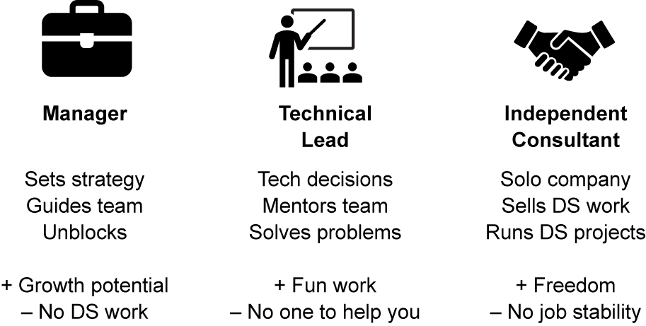

This is the fifth post in a series with the same title. The first issued a [call to action](https://jimgruman.netlify.app/post/2021-01-22-data-evangelist/) with six ideas to kick start a transformation towards digital literacy, diversity, and inclusiveness. The second post reflected on organizational change and Doug Muegge's [six questions](https://jimgruman.netlify.app/post/2021-02-05-data-evangelist-part-2/) on how we know we all are going the right direction. The third explored AI cultural change and how a leading AI company like Microsoft manages a distributed [center of excellence on Artificial Intelligence](https://jimgruman.netlify.app/post/2021-03-01-data-evangelist-part-3/). The [fourth and most recent edition](https://jimgruman.netlify.app/post/2021-03-12-data-evangelist-part-4/) argued that the critical foundation is built on sound, rigorous communities of practice where the craft of analytics is advanced by practitioners. Repeating one paragraph:

> [Business leaders recognize the importance of starting with a clear requirements definition for the business opportunity. Product owners know that insights accumulated on the AI journey may cause directional adjustments as the team uncovers the truth from the data. At every level, teams must avoid having the pursuit of business value turn into simply a lab experiment with new technology. The promise of AI is real, but as data is explored, the findings may surprise everyone. This doesn’t mean making everybody a data scientist, but it calls for establishing data literacy throughout the extended enterprise. The community of practice is also an opportunity for individuals to share the rigor of what they are doing and how they are doing it.](https://jimgruman.netlify.app/post/2021-03-12-data-evangelist-part-4/)

This short post will dwell on what an executive team can expect from an AI Center of Excellence. They do not (and are not  expected to) have the technical acumen for every aspect of leading-edge AI. Although the executive team could seek outside advice, to realize sustainable competitive advantage this set of competencies needs to be built and led internally. On that note, this short post explores 

- Talent and Role Definitions
- Upcoming Events
- Rigor
- learning resources, and
- 2 book recommendations.

Whatever prompted you to read this blog post, I hope that you come away with a handful of useful insights for your own work.

----



## Talent and Role Definitions

Early in every university statistics 101 course there is that moment when the professor delivers the line about what happens to the average income of the room when Bill Gates walks in. Of course, the story is a bridge to a conversation about the median and interquartile range.  Later, students hear the story of Siméon Denis Poisson's estimation of the annual number of Prussian cavalry soldiers killed due to horse-kicks. If you are lucky, you might learn there to apply Poisson's distribution to modern examples like estimating the number of car crashes, or forecasting counts of fault code events. 

Data science has its roots in the same statistical work. This raises the question of whether an AI COE should be combined with engineering & analytics groups already embedded into regional/functional groups.  If an existing  group is already practicing in predictive analytics, it stands to reason those skills could be applied to other AI projects, and a combined organization makes sense.

Before returning to Talent and Roles, let's take a short detour through OKRs:

----

### Objectives and Key Results 

[OKRs](https://www.profit.co/blog/okr-university/what-are-okrs/) are a startup and tech company refinement of the widely used management by objectives (MBO). The subtle difference is that OKRs are arrived at through a collaborative process. Peter Drucker, who first popularized MBO, suggested that a manager should review the organization's goals and then set each worker's objectives. In contrast, OKRs rely on the teams within the organization to take high-level objectives and refine key results for their specific area. And when teams have to work with other partners in the organization to objectives, those teams must collaborate and write OKRs together to ensure alignment. 

Its more useful to think about the “OKR process” than it is to simply consider the “objective” and the “key result” bits. Static goals that aren’t regularly reviewed and revised as the operating environment changes quickly become meaningless. Combining clear objectives with a small set of specific, measurable results and a cadence of reviewing progress toward those measures is what gives OKRs driven organizations an advantage. Five key elements of OKRs include:

**Focus:** No more than 3 – 5 objectives, in a single line, and less than 5 Key Results per objective.

**Alignment:** Corporate employees are often unaware of organizational strategy and goals. OKRs solve this problem by ensuring that they are cascaded. Alignment gives clarity to employees about how their work contributes.

**Commitment:** Commitments are OKRs to be achieved without fail in the chosen time period. 

**Tracking:** OKRs are tracked every week. Metrics for Key Results are established at the beginning of the quarter.

**Stretching:** OKRs help the team elevate their performance beyond what they thought “was possible.” So the goals are ambitious, and a 70% achievement is considered as “strong performance.”

----

Artificial intelligence and advanced analytics skill sets are in demand. My company, like others, has functional groups and regional locations attempting to hire all kinds of analysts, data scientists, and data engineers today. Most functional groups are also outsourcing services through consultants. The scarcity of talent and expertise means it is even more critical to create a critical mass, as a community. Unfortunately, a large proportion of the market for new talent is aiming to join the 100,000 at Google, the 160,000 at Microsoft, or the 492,000 at Accenture. Each of those companies have learning development processes and OKRs.

An important characteristic of community is that the same rigor and standards must be fulfilled everywhere, to allow for rotational development and project embedding. Whether working in modern econometrics or epidemiology, emerging techniques are front and center, and many of the same techniques are also useful in industrial contexts. There is much to be learned from one another between domains.

Yet there is also a need to align technical assessments of candidates for professional roles, and make it clear what is required to advance from a junior position to a senior position. Even the job-posting requirements language must be clarified to attract the right talent, and ensure candidates understand the expectations of the roles. 

> Every path to digital competency is going to be different. Like [Paige Bailey](https://twitter.com/DynamicWebPaige/status/1360303252219154432), I want not to be surprised if a data scientist used to be a biologist, or a bartender, or a geologist. DS skills do not require an ivory tower, or time sacrificed on acronyms for a Ph.D. Your Github should be your CV.

----

## Events

These are opportunities to engage and learn about analytics, data science, and AI from peers.

⭐️ April 6-7th [ISU Analytics Symposium](https://www.ivybusiness.iastate.edu/analytics-symposium/)

⭐️ April 12-14th
[INFORMS Business Analytics Conference](http://meetings2.informs.org/wordpress/analytics2021/)

⭐️ September 6-10th [EARL Conference 2021]( https://info.mango-solutions.com/earl-2021#:~:text=EARL%202021%206%2D10th%20September,of%20the%20world%27s%20leading%20practitioners)

----



## Rigor 

Since the days of Sarbanes-Oxley in the `00s, and more recently GDPR,  organizations have documented policies in various places for data governance and security review. Some may be overlapping. And some are not widely known, or conformed to, leaving gaps. There must be a champion for driving standards and rigor across the enterprise, especially in AI. As a practical matter, this means, prior to deployment, all work should be subject to “peer review” by the business. 

It also means statistical models must be retained, and AI model performance reviewed periodically by the business, post deployment. More than anything, a single clear champion for standards and rigor must be identified. Though that person might currently sit in finance or audit, or even information technology, 

This new role:  Principal Data Scientist

The expert in data science, responsible for helping others do data science

Four main responsibilities:

**Strategy:** lay out the plan for tackling data science problems. Is modeling a given business problem even feasible? Should a neural network be used? 

**Setting Standards:**  driving cross-functional co-ordination and synergy.

**Mentoring:**  facilitating knowledge transfer and dissemination of information/news

**Finding solutions** to the company’s most difficult problems.

Compared with a business manager, the principal data scientist is still very much doing data science work, reading technical papers, being part of the technical community. This role is all data science all the time.

----

‘Inclusive AI’ would recognize individuals for their achievements in advancing the state of the art in both digital literacy and in AI.

By Domain expertise and business acumen, Location, and even skill level

Especially as the state of the art advances. Given open source tools and compute resources, what can they build and share?

Employees at any career stage should be welcome to join and encouraged to opt-in, even for their own career development.

To make these as collaborative as possible, members should be expected to meet and share within their community of practice periodically.

Grouped by clusters, or affinity groups, with local champions and mentors to ensure that development advances.

----

As with Toastmasters, AI affinity groups are not meant to align with organizational silos. 

It is better affinity groups be geographically clustered and have a local champion that fosters extreme collaboration at periodic events.

They would take strategic direction from…

The Artificial Intelligence Center of Excellence:

This core leadership team includes the leading experts, including the company’s principal data scientist. 

Among others, their prime deliverables to the business and AI community of practice are:

Craft a vision for AI in the company.

It’s important for executives to discuss — ideally with AI experts — what AI is, what it can do, and how it might enable new business models and strategies. Otherwise, it may sub-optimize what AI can ultimately do for the business.

Identify highest-value business-driven use-cases. Developers of AI capabilities will need a prioritized list of applications or use cases within the company. They should balance strategic value with what is achievable. Companies may develop some of these use cases as pilots or prototypes, but they should also have a “pipeline” — regularly monitored by the AI center and by executives — that leads to robust production deployment.

Determine the appropriate level of ambition.

Since AI typically supports tasks rather than entire business processes, it is usually best to undertake less ambitious projects as opposed to “moon shots.” But in order to get management attention and have a substantial impact on the business, organizations may want to undertake a series of smaller projects in one area of the business. This requires a road map, showing multiple use cases across a timeline, with resources and dependencies. An AI center can help the company “think big, but start small.”

Create a target data architecture.

The vision and use-cases define the data platform and tools needed to deliver. This is key for all (data-relevant) projects, and all types of data — structured, unstructured, and external. SQL server is the standard data management platform today, but the AI center needs to decide between on-premises versus cloud variations, and self-maintained open source solutions versus licensed solutions. Most companies benefit from using user-ready analytics tools with open-source components enabling quick user-friendly modeling, rather than packaged tools that are rigidly BI-oriented.

Manage external innovation.

An AI center can orchestrate relationships with universities, vendors, AI start-ups, and other sources of expertise and innovation. The company can develop an AI ecosystem, and perhaps even invest in firms that show promise of adding value to the business. This is also important for the tools and technology to be best-in-class.
Facilitate on-going recruiting, attracting, and building talent. It is no secret that leading-edge AI engineers and data scientists (statisticians) are difficult to find, let alone hire.

Spread success stories.

A key success factor with AI or any new technology is to spread early success stories with prioritized use cases. This will build the appetite for more AI activity, in effect performing a marketing function for the AI center itself, and the AI talent group.

Develop and maintain a network of AI champions.

An AI center will work best if it cultivates a network of influential supporters and champions for the technology across the business. Given the commoditization of programming (with readily available scripts in languages like R- and Python), the focus for in-house capability building should be on statistical and mathematical modeling, in business-relevant, value-creating use-cases, rather than pure programming.

----

## Learning Resources

Josh Starmer statquest



----

## Book recommendations

Build a Career in Data Science

The Chapters of Part 4 cover material on career paths in data science.

Success in data science depends on the flexible and appropriate use of tools. That includes Python and R, the two foundational programming languages in the field. With this book, data scientists from the Python and R communities will learn how to speak the dialects of each language. By recognizing the strengths of working with both, you'll discover new ways to accomplish data science tasks and expand your skill set.

----

As Cassie Kozyrkov points out in her [video tutorial](https://youtu.be/YsrPImZyisI) follow your personality when exploring the unknown. If you want to make a few important decisions under uncertainty, go with statistics. If you want to automate and make a million decisions under uncertainty, then machine learning is the way to go. But what if you don't know how many decisions you want to make before you start? Or, you feel lost in your quest for inspiration, but you are still excited by the ambiguity of exploration? If you want to understand your world, this is analytics.

----

## Related posts

[the last post of the Data Evangelist series](https://jimgruman.netlify.app/post/2021-03-12-data-evangelist-part-4/)

[AI and Data Strategy](https://jimgruman.netlify.app/post/ai-and-data-strategy/)

----

### Did you find this page helpful? Consider sharing it 🙌