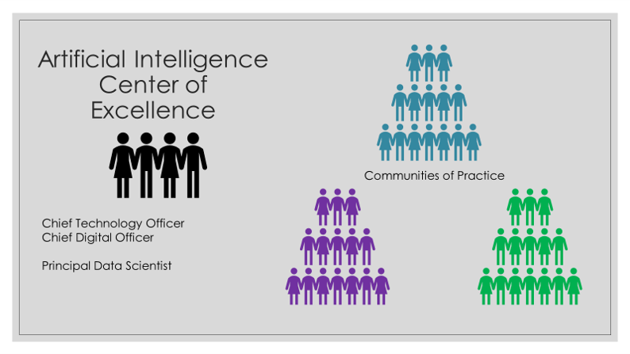

This is the fifth post in a series with the same title. The first issued a [call to action](https://jimgruman.netlify.app/post/2021-01-22-data-evangelist/) to kick start digital literacy, diversity, and inclusiveness. The second post reflected on how difficult organizational change is and introduced [six questions](https://jimgruman.netlify.app/post/2021-02-05-data-evangelist-part-2/) to gauge how we know we all are going the right direction. The third explored AI culture and how a leading AI company like Microsoft manages a distributed [center of excellence on Artificial Intelligence](https://jimgruman.netlify.app/post/2021-03-01-data-evangelist-part-3/). The [fourth and most recent edition](https://jimgruman.netlify.app/post/2021-03-12-data-evangelist-part-4/) argued that the critical foundation is built on sound, rigorous communities of practice where the craft of analytics is advanced by practitioners. Repeating one paragraph:

> [Business leaders recognize the importance of starting with a clear requirements definition for the business opportunity. Product owners know that insights accumulated on the AI journey may cause directional adjustments as the team uncovers the truth from the data. At every level, teams must avoid having the pursuit of business value turn into simply a lab experiment with new technology. The promise of AI is real, but as data is explored, the findings may surprise everyone. This doesn’t mean making everybody a data scientist, but it calls for establishing data literacy throughout the extended enterprise. The community of practice is also an opportunity for individuals to share the rigor of what they are doing and how they are doing it.](https://jimgruman.netlify.app/post/2021-03-12-data-evangelist-part-4/)

I was preoccupied this week with a handful of discussion threads where the crux of the issue was our confidence in whether staff has sufficient skill sets to take on moonshot projects. In some ways, the conversation resembles the old QS-9000 manufacturing skills inventory, but the critical difference is that we aim to develop AI that has never previously been developed. The alternative, of course, is to outsource even more work to firms that claim to have the skills. Bill Frank's [IIA webinar talk](https://youtu.be/2iZDb14QQZg) this week on Modernizing the Roles was timely. The short takeaway of the hour long talk is that we are not alone in trying to sort this out.

This short post will cover what an executive team can expect from an AI Center of Excellence. Business leaders do not (and are not  expected to) have the technical acumen for each and every aspect of leading-edge AI. Although the executive team could seek outside advice, to realize sustainable competitive advantage this set of competencies also needs to be built and led internally. On that note, this short post explores 

- Talent and Role Definitions,
- Upcoming Events,
- The Principal Data Scientist,
- Skills Inventory,
- The Artificial Intelligence Center of Excellence,
- and 2 book recommendations.

Whatever prompted you to read this blog post, I hope that you come away with a handful of useful insights for your own work.

----



## Talent and Role Definitions

Early in every university statistics 101 course there is that moment when the professor delivers the line about what happens to the average income of the room when Bill Gates walks in. Of course, the story is a bridge to a conversation about the median and interquartile range.  Later, students hear the story of Siméon Denis Poisson's estimation of the annual number of Prussian cavalry soldiers killed due to horse-kicks. If you are lucky, you might learn there to apply Poisson's distribution to modern examples like estimating the number of car crashes, or forecasting counts of fault code events. 

Data science has its roots in the same statistical work. This raises the question of whether an AI CoE should be combined with engineering & analytics groups already embedded within regional/functional groups.  If an existing  group is already practicing predictive analytics, it stands to reason those skills could be applied to other AI projects and a combined organization makes sense.

Cassie Kozyrkov looks at the skills continuum in her [ML video tutorials](https://youtu.be/YsrPImZyisI). When we want to make a few important decisions under uncertainty, we go with statistics. If we want to automate and make millions of decisions under uncertainty, then machine learning is the way to go. But what if we don't know how many decisions we want to make before we start? Or, we feel lost in our quest for inspiration, but are still excited by the ambiguity of exploration? If we want to understand our world, this is analytics.

Before returning to Talent and Roles, let's take a short detour through OKRs:

----

### Objectives and Key Results 

[OKRs](https://www.profit.co/blog/okr-university/what-are-okrs/) are a tech company refinement of the widely used **m**anagement **b**y **o**bjectives (MBO). The subtle difference is that OKRs are arrived at through a collaborative process. Peter Drucker, who first popularized MBO, suggested that a manager should review the organization's goals and then set each worker's objectives. In contrast, OKRs rely on the teams within the organization to take high-level objectives and define key results for their specific area. And when teams have to work with other partners in the organization to objectives, those teams must collaborate and write OKRs together to ensure alignment. 

Its more useful to think about the “OKR process” than it is to simply consider the “objective” and the “key result” bits. Static goals that aren’t regularly reviewed and revised as the operating environment changes quickly become meaningless. Combining clear objectives with a small set of specific, measurable results and a cadence of reviewing progress toward those measures is what gives OKR driven organizations an advantage. Five key elements of OKRs include:

**Focus:** No more than 3 – 5 objectives, in a single line, and less than 5 Key Results per objective.

**Alignment:** Elsewhere, employees are often unaware of organizational strategy and goals. OKRs solve this problem by ensuring that they are cascaded. Alignment gives clarity to employees about how their work contributes. And the technical content of the Key Result falls on the technical team members.

**Commitment:** Commitments are OKRs to be achieved without fail in the chosen time period. 

**Tracking:** OKRs are tracked every week. Metrics for Key Results are established at the beginning of the quarter.

**Stretching:** OKRs help the team elevate their performance beyond what they thought “was possible.” So the goals are ambitious, and a 70% achievement is considered as “strong performance.”

A large proportion of the AI talent pool today is aiming to join the 100,000 at Google, the 120,000 at Alibaba, the 160,000 at Microsoft, the 492,000 at Accenture, or even the 1.3 million at Amazon. Each organization has their own take on AI learning development and OKRs.



----

### Decision Making

Artificial intelligence and advanced analytics skill sets are in demand. A common challenge for legacy non-tech companies, covered in a [previous post on Extreme Ownership](https://jimgruman.netlify.app/post/2021-03-12-data-evangelist-part-4/), is the need for candor.

AI projects need rigorous decision makers more than any other role. Why? If the team lacks the skills to set clear success metrics at the beginning of the project, there is no point in all of the beautiful engineering. If teams don't have the capability to self-organize & self-manage (yet)... they're not ready for agile. In the hands of [competent decision makers](https://medium.com/hackernoon/the-decision-makers-guide-to-starting-ai-72ee0d7044df), scalable technology can help solve many of the biggest problems we face.



My company, like others everywhere in industry, has functional groups and regional locations attempting to hire all kinds of analysts, data scientists, and data engineers today. Most functional groups are also outsourcing services through consultants. The scarcity of talent and expertise means it is even more critical to create a critical mass as a community. 

The same rigor and standards really need to be universal to allow for rotational development and project embedding. Whether working in modern econometrics or epidemiology, emerging techniques are front and center. Many of the same techniques are also useful in industrial contexts. There is much to be learned from one another between domains.

There is also a need to align technical assessments of candidates for DS and analytics job postings, and make it clear what is required to advance from a junior to a senior position. Even the job posting requirements language must be clarified to attract the right talent and ensure candidates understand the expectations. 

> Every path to digital competency is going to be different. Like [Paige Bailey](https://twitter.com/DynamicWebPaige/status/1360303252219154432), I want not to be surprised if a data scientist used to be a biologist, or a bartender, or a geologist. DS skills do not require an ivory tower, or time sacrificed on acronyms for a Ph.D. Your Github should be your CV.

----

## Events

These are opportunities to engage and learn about analytics, data science, and AI from peers.

⭐️ April 6-7th [ISU Analytics Symposium](https://www.ivybusiness.iastate.edu/analytics-symposium/)

⭐️ April 12-14th
[INFORMS Business Analytics Conference](http://meetings2.informs.org/wordpress/analytics2021/)

⭐️ April 21st [IIA's Spring Symposium](http://iiasymposium.com)

⭐️ September 6-10th [EARL Conference 2021]( https://info.mango-solutions.com/earl-2021#:~:text=EARL%202021%206%2D10th%20September,of%20the%20world%27s%20leading%20practitioners)

----



## The Principal Data Scientist

Since the days of Sarbanes-Oxley in the `00s, and more recently GDPR,  organizations have added layers of policy documentation in various places for governance and security compliance. Some may be overlapping. And some are not widely known, or conformed to, leaving gaps. It should be obvious that there must be a single champion for driving standards and rigor across the enterprise, and this is even more true in AI. AI models must be retained and  performance reviewed periodically by the business, post deployment. Though parts of the role might currently reside in finance, internal audit, or even information technology, the statistical expertise required adds another critical dimension. Again, as a practical matter of assuring rigor, this means that, prior to deployment, all work should be subject to “peer review” by the business. 

Many organizations with chief engineers and technical `fellows` now have a singular role titled **Principal Data Scientist**. She is

the expert in data science, responsible for helping others do data science, with four main responsibilities:

**Strategy:** lay out the plan for tackling data science problems. Is modeling a given business problem even feasible? Should a neural network be used? 

**Setting Standards:**  driving towards cross-functional co-ordination and synergies.

**Mentoring:**  facilitating knowledge transfer and dissemination of information/news to every corner of the company.

**Finding solutions** to the company’s most difficult problems.

In contrast to a business manager at any level, the principal data scientist is still very much doing data science work, reading technical papers, acting as an active participant in the technical community. This role is all data science all the time. And the Principal Data Scientist then is a core member of the AI Center of Excellence. More on this in a moment.

----



## Skills Inventory

Compiling a team skills inventory is a bit like asking for a list of the books each person has read. Even after augmenting the list by domain expertise, business acumen, location, and even tenure, it's still not very useful.

A better question:  Given open source tools and compute resources, what is the potential of this person to build and deliver? And what is their potential as the state of the art advances and new use cases are brought by the business? How can we assess human potential?

In the COVID era, I've re-calibrated my own views on the AI conference and education landscape. The exclusive, expensive private events from ODSC,  Forrester, and Gartner give the aura of delivering knowledge that nobody else has from their advisory panels, but much of it is an illusion. Bootcamps and on-line programs, like Coursera or DataCamp, have also lost some of credibility that they had in previous years.  If you are not familiar with it, take a moment to check out [DeepLearning.AI](https://www.deeplearning.ai/), Andrew Ng's platform for AI education, for your own perspective:



The best practices today distinguish themselves by fostering student engagement, providing forums for people to present what they have learned and built to their harshest critics, their classmates. In the case of DeepLearningAI, the events are called [Pie & AI](https://www.deeplearning.ai/ambassador/).

Professional groups like INFORMS and the R Consortium are adapting well to serving members and providing engagement, now through their own virtual [meetups](https://www.meetup.com/pro/r-user-groups/) and hackathons. Many local chapters have topic groups that meet periodically (often monthly) and solicit presentations from members. Some of these communities of practice are mimicked internally in corporate environments as part of training and mentorship programs.

Starting from the entry level for Business Intelligence or even Citizen Data Scientist, employees at any career stage should be welcome to opt-in to learn more, even for their own career development. To make these as collaborative as possible, experts at higher levels should be expected to meet and share within their community of practice periodically to drive digital growth. ‘Inclusive AI’ would recognize individuals for their achievements in advancing the state of the art for their location in both digital literacy and in deploying models.

The curation of knowledge clusters, or AI affinity groups, along with identifying local champions and mentors, ensures that digital skills development advances. As with Toastmasters, AI affinity groups are not meant to align with organizational silos. Examples might include 

- time series forecasting, 

- deep learning vision systems,

- NLP and chatbots, 

- A/B testing and customer experience,

- survival, reliability, and econometrics, 

- and data visualization

They take strategic direction from the…

## Artificial Intelligence Center of Excellence

This core leadership team includes the leading experts, including the company’s principal data scientist. Among others, their prime deliverables to the business and communities of practice are:

#### Craft a vision for AI in the company.

Its important for executives to discuss, ideally with experts, what AI is, what it can do, and how it might enable new business models. The vision must identify the highest-value business-driven use-cases. They should balance strategic value with what is achievable. Companies should have a pipeline, regularly monitored by the AI center and by executives, that leads to robust production deployment.

#### Determine the appropriate level of ambition.

Since AI typically supports tasks rather than entire business processes, it is usually best to undertake limited projects as opposed to moon shots. This requires a road map, showing multiple use cases across a timeline, with resources and dependencies. An AI center can help the company “think big, but start small.”

#### Create a target data architecture.

The vision also defines the data platform and tools needed to deliver. SQL server is our standard data management platform today, but the AI center needs to decide between on-premises versus cloud variations, and self-maintained open source solutions versus licensed solutions. Most companies benefit from using user-ready analytics tools with open-source components enabling quick user-friendly modeling, rather than packaged tools that are rigidly BI-oriented.

#### Manage external innovation.

An AI center must orchestrate relationships with universities, vendors, AI start-ups, and other sources of expertise and innovation. The company can develop an AI ecosystem, and even invest in firms that show promise of adding value to the business. This is also important for the tools and technology to be best-in-class.

Also, the center must facilitate on-going recruiting, attracting, and building talent. It is no secret that leading-edge AI engineers and data scientists (statisticians) are difficult to find, let alone hire.

#### Spread success stories.

A key success factor with AI or any new technology is to spread early success stories with prioritized use cases. This builds the appetite for more AI activity, in effect performing a marketing function for the AI center itself, and the AI talent group.

#### Develop and maintain a network of AI champions.

An AI center will work best if it cultivates a network of influential supporters and champions for the technology across the business. Given the commoditization of programming (with readily available scripts in languages like R- and Python), the focus for in-house capability building should be on statistical and mathematical modeling, in business-relevant, value-creating use-cases, rather than pure programming.



----

## Book recommendations

Success in data science depends on the flexible and appropriate use of tools. That includes Python and R, the two foundational languages in the field. This book, to be released soon, helps with learning how to speak the dialects of each language. By recognizing the strengths of working with both, discover new ways to accomplish data science tasks and expand skill sets.

----

## Related posts

[the last post of the Data Evangelist series](https://jimgruman.netlify.app/post/2021-03-12-data-evangelist-part-4/)

[AI and Data Strategy](https://jimgruman.netlify.app/post/ai-and-data-strategy/)

----

### Did you find this page helpful? Consider sharing it 🙌