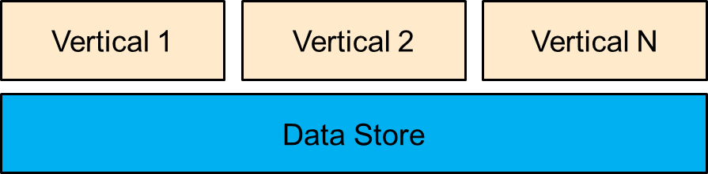
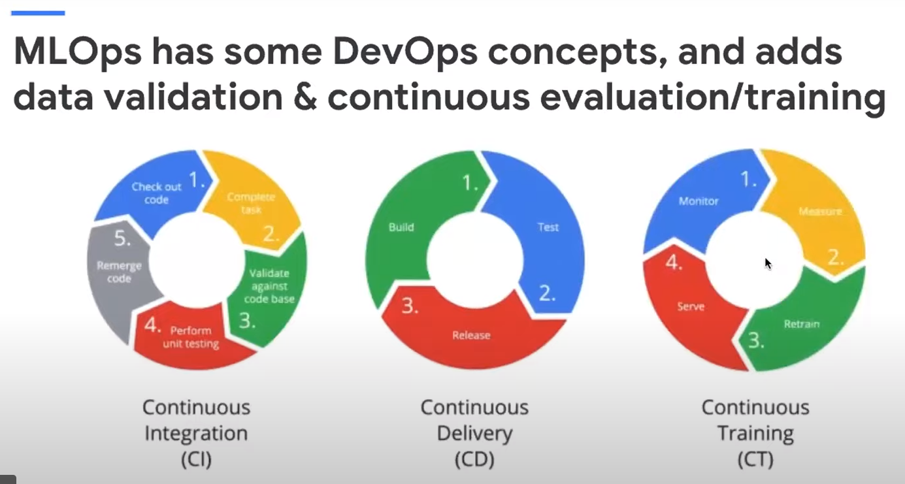
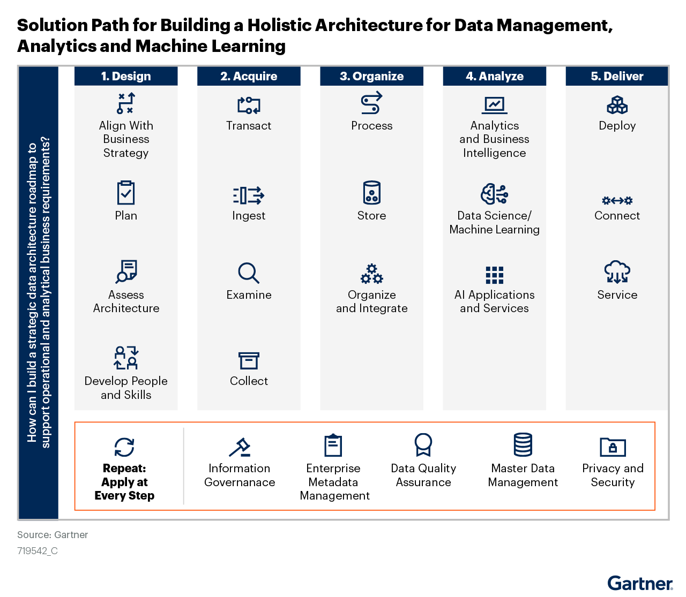
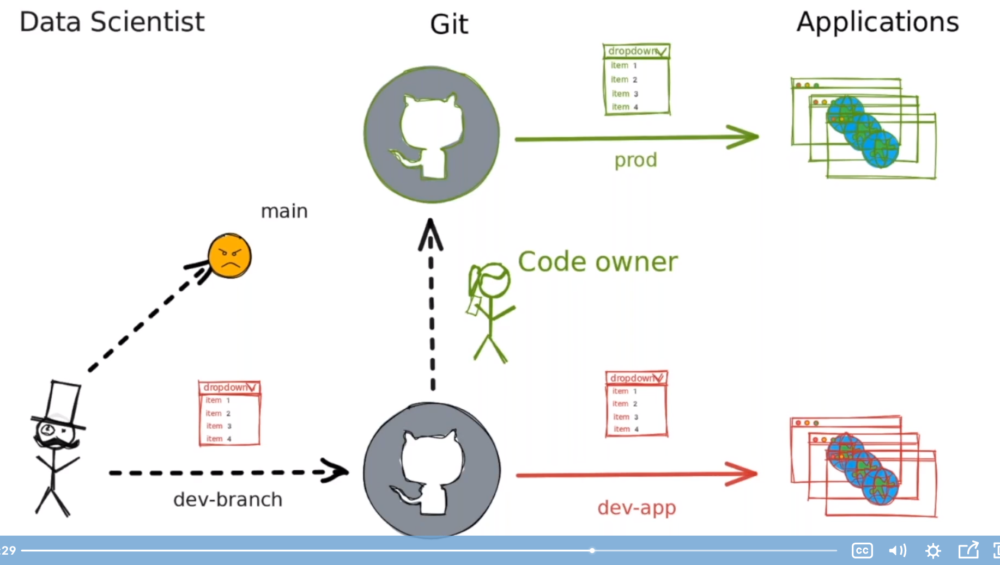

For this, the sixteenth post of the series, we are going to explore a few of the [graphical abstractions](https://en.wikipedia.org/wiki/Graphical_abstract) used in data science. Technical people take pride in mastering arcane skills sets. We like to talk about tools and complex math. Unfortunately, some audiences cynically attribute the motivations for tech presentations as sales pitches for tools, or worse: "when you are a hammer :hammer:, every problem is a nail."  Graphical abstractions ground everyone on the mission and on where we each fit in.  

An example of a graphical abstraction:

> 

With the arrival of a new CEO, the phrase "**North Star**" is now part of our corporate vernacular.  Your North Star is your personal mission statement. It’s a fixed destination that you can depend on in your life as the world changes around you. Graphical abstractions acknowledge the North Star, and convey connections with customer, client, and the business in simple, clear visuals.

This post highlights recent graphical abstractions used in talks by luminaries in the field. They include Dr. Lak Lakshmanan, JD Long, Tori Oblad, Frank Corrigan, Dr. Daniel Whitenack, Chris Benson, Colin Gillespie and others. Whatever prompted you to read this, I hope that you come away with a handful of useful insights for your own work.

----

## Google's AI Platform

[Dr. Lak Lakshmanan](https://twitter.com/lak_gcp) is the head of Data Analytics and AI Solutions at [Google Cloud Platform](https://cloud.google.com/gcp/), and was formerly a Director at [Climate Corporation](https://www.climate.com/company/press-releases/new-climate-basic-functionality/) leading a team of data scientists building probabilistic estimates of past, current and future weather. He is the author of several fantastic [books](https://aisoftwarellc.weebly.com/books.html) on topics ranging from ML in climate science, to geospatial analysis techniques, to Google BigQuery. 

Dr. Lakshmanan recently delivered a talk titled [Building a Data Cloud to Enable Analytics and AI-Driven Innovation](https://www.meetup.com/Serverless-Toronto/events/277818918/) for [Serverless Toronto](https://www.meetup.com/Serverless-Toronto). His slides are [posted here](https://www.slideshare.net/dzivkovi/building-a-data-cloud-to-enable-analytics-aidriven-innovation-lak-lakshmanan).

<iframe width="560" height="315" src="https://www.youtube.com/embed/ntBEQdD1IeQ?start=280" title="YouTube video player" frameborder="0" allow="accelerometer; autoplay; clipboard-write; encrypted-media; gyroscope; picture-in-picture" allowfullscreen></iframe>

After a walk through [Home Depot](https://www.homedepot.com/)'s web experience and a demonstration of the machine learning elements employed to shape customer journeys there, the talk moved to the work that any innovative AI development team must do to deliver. Design patterns for data and problem representation, operationalization, repeatability, reproducibility, flexibility, explainability, and fairness all exist and should not have to be built from scratch. Lak noted that there exist pre-trained image and spoken language models that require modest additional data before deployment.

In structured business data contexts, analysts that currently work in SQL could themselves take advantage of machine learning algorithms. BigQuery ML is just an easy-to-use way to invoke machine learning models on structured data using SQL. Google's graphical abstraction of CI/CD/CT illustrates a development ideal for AI.

----

## Empathy in Action

In this short [JD Long](https://twitter.com/CMastication) talk, he discusses how he works to create a supportive learning environment focused on helping analysts "kick ass" regardless of their tool kit. 

Great educators use [scaffolding](https://www.gcu.edu/blog/teaching-school-administration/what-scaffolding-education) to launch newcomers within a guided framework, providing more support at first. Over time, as learners become more independent, the scaffold is removed. New members on our business teams need scaffolding and mentoring, too. Graphical abstractions are an important part of starting people down the right path.

JD pulls from Kathy Sierra's book [Badass: Making Users Awesome](https://www.oreilly.com/library/view/badass-making-users/9781491919057/) to argue for helping people get better at what they are doing in a way that is meaningful to where they are in their roles right now. The techniques apply equally well to users of any tools we build, out in the field.

> 

While having a plethora of data is a great position to be in, democratizing information across the business is not ever easy. In fact, it is precisely this overabundance of data, and the sharing of it, that creates challenges in most organizations. Particularly,

* Cognitive overload due to the overwhelming count of dashboards to track on a daily, weekly, monthly, or quarterly basis. Dashboard fatigue is a real thing and overloading stakeholders with data can lead to feeling overwhelmed, severely stifling efficacy.
* Lack of annotations and explanations can make information hard to digest and understand (after all, isn’t it our primary responsibility as analytical folks to make complex data sets digestible to people that might not have a background in stats or mathematics?)
* While many sophisticated BI tools are available, they require stakeholders to be driven and experts in multiple tools.

----

## Enterprise Data Store

Let's return to the graphical abstraction from the introduction:

> 

A managed data store is foundational to delivering business success. Each vertical is a functional business unit. They include spare parts, quality and product support, capital, inbound supply chains, outbound logistics, marketing, powertrain development, network development, and others. They include each geographic region. With some work all of the verticals then deliver on the customer, client, and business mission. 

Data engineers ensure that each vertical has capacity to fulfill its unique data movement requirements for service levels, whether real time latency or high volume, audio, video, telematics, geospatial, ...whatever. Accountants ensure that the compute costs of each vertical are allocated to its own geographic or functional group. Information security covers the unique challenges in protecting systems from vulnerabilities and maintaining compliance at every port.  Human resources ensures that job descriptions, skills, and headcount are organized into accountability and incentive boxes. 

The Gartner consultancy uses a standard iconography in all of their graphical abstractions. This [Solution Path](https://www.gartner.com/document/3994838) is an executive roadmap, or checklist, for building the Data Store for Analytics and Machine Learning.

> 

In five easy steps :wink:, these broad enterprise needs are fulfilled:

1) Accelerate data exploration and the velocity of prototyping, everywhere (beyond the skunk works, out in the business)

1) Increase the ability to develop and scale models for ever larger use-cases

1) Enable business to self-service from cataloged clean data features stores within a safe, secure containerized environment

1) Provide a platform for any Business Intelligence (BI) or UX tool (Streamlit, Shiny) to easily create dashboards, messaging (SMS, MS Teams Alert, etc.), and other business reporting everywhere

----

## Data Science Hangouts

A few weeks ago on Rachel Dempsey's [data science hangout](https://www.youtube.com/watch?v=a3ViJuhEthc&list=PL9HYL-VRX0oTel3ncl-YePCh0Yw7QNCEb), we chatted about what has worked well for leaders launching their own internal data science communities. She went back through the recording and pulled out a few awesome tips from [Tori Oblad](https://www.linkedin.com/in/torioblad/) and [Frank Corrigan](https://www.linkedin.com/in/franciscorrigan3/):

**Tori:**
> "What I’ve found the most useful is starting with a few key people in certain areas that want to learn something and working with them 1:1. If I can help them start to figure out how to fix their problem, this is key. It has to be something that affects them otherwise it goes away and people will forget what they’ve learned. "

> "Starting a community where it can be 1:1, you can ask them what the issues are and how they think they should go about it? When you can find those key people that are excited, they will actually start learning. They may share their excitement internally and it’s more credible to hear from somebody that is not a data scientist or super programmer that you can do it. I’ve found that it’s very useful to have Excel users or beginner analysts to help grow the internal community. "

> "Partner with the business. Generally, your business users are not programmers. A lot of that communication where we have an objective that we’re trying to meet, through those discussions you’ll generally find small bits of “How are you going about that? Maybe we can tackle that in a different way." It turns into a lot of small side projects but it’s those relationships that you’re making where you find the people that need help."

**Frank:**
> "At my company, what I’ve found to be very helpful is leading little learning cohorts and I really focus on exploratory data analysis. I can create these cohorts with some business analysts in there who work in inventory management or transportation and pair them up with people who may be in more technical data analysis roles. If you can get them to learn together on a cadence, they form relationships and understand each other’s problems and they learn R at the same time. Any Excel user that discovers R, it’s unlikely that they’re going to only use Excel from now on."

----

## The Practical AI Podcast

The [Practical AI Podcast](https://changelog.com/practicalai), hosted by [Daniel Whitenack](https://twitter.com/dwhitena) (visiting Professor at Purdue) and [Chris Benson](https://twitter.com/chrisbenson) (of Lockheed Martin), hosts discussions to make artificial intelligence practical, productive, and accessible to everyone. In this episode they get a behind the scenes look at #SLICED and explore one approach to building a large data science community. (48 minutes)

<audio data-theme="day" data-src="https://changelog.com/practicalai/144/embed" src="https://cdn.changelog.com/uploads/practicalai/144/practical-ai-144.mp3" preload="none" class="changelog-episode" controls></audio>

There are [IoT communities in Chicago](https://chicagoconnectory.com/) and other major cities that host hackathons and meetups, whether for social good, for collaborative learning, or for career networking. Some employers hiring for analytics and data science talent go beyond university career offices to find it in the contributors to open source projects and in these communities. 

----

## R in Production

Bridging the gap between data science and IT teams is easier to do than many would think. [Colin Gillespie](https://twitter.com/csgillespie) provides a big picture view in this short talk on using open source languages and tools in secure enterprise environments.

One of graphical abstractions he draws relates to the role of version control and code review in a mature analytics team's production system. At a minimum, any system that has an [SLA](https://en.wikipedia.org/wiki/Service-level_agreement) must have at least one dev branch and a code owner review process.

-----

## Upcoming Events

These are opportunities to engage and learn about analytics, data science, and AI from peers. Meetups and other talks are so important because you can learn so much from the community and the people that are actually doing it today.

:star: August 12th [Practical Advice for R in Production, Part 2](https://www.rstudio.com/registration/practical-advice-for-r-in-production-2/)

:star: August 25th [Machine Learning and Artificial Intelligence for Decision-Making Under Uncertainty](https://event.webcasts.com/starthere.jsp?ei=1479032&tp_key=40b0ed0ef7)

:star:️ September 6-10th [EARL Conference 2021](https://info.mango-solutions.com/earl-2021#:~:text=EARL%202021%206%2D10th%20September,of%20the%20world%27s%20leading%20practitioners)

:star: September 8-10 [New York R Conference](https://twitter.com/rstatsai)

:star: September 14-16 [SAE COMVEC](https://www.sae.org/comvec)

:star: September 16-17 [INFORMS Midwest Regional Analytics Conference](http://meetings2.informs.org/wordpress/regional-analytics-midwest2021/) Chicago Chapter hosting, virtual event

:star: October 6 [IIA's 2021 Fall Virtual Analytics Symposium](http://iiasymposium.com/index.php/registration/)

:star: October 24-27 [2021 INFORMS Annual Meeting](http://meetings2.informs.org/wordpress/anaheim2021/)

----

## Book Recommendation

Imagine you are in a game with one objective: deliver a bestselling product or service. The rules? No marketing budget, no PR stunts, and it must be sustainably successful. No short-term fads.

Our goal is to craft a strategy for creating successful users. And that strategy is full of surprising, counter-intuitive, and astonishingly simple techniques that don’t depend on a massive marketing or development budget. Techniques typically overlooked by even the most well-funded, well-staffed product teams. Every role is a key player in this game: Product development, engineering, marketing, user experience, support -- everyone on the team. 

----

## Related posts

[the last post of the Data Evangelist series](https://jimgruman.netlify.app/post/2021-06-25-data-evangelist-part-15/)

------------------------------------------------------------------------

### Did you find this page helpful? Consider sharing it :raised_hands:
