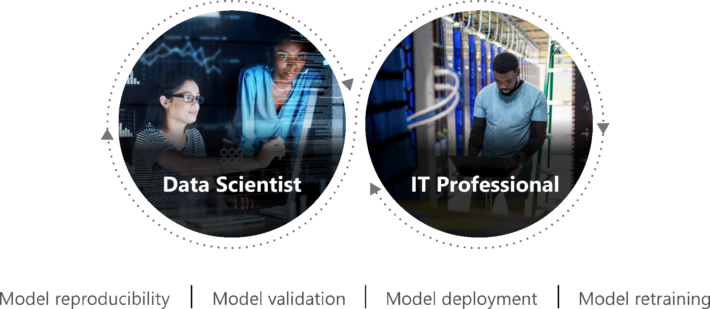

Writers intrude on the patience of readers by asking that you put aside time to hear us out. As an engineer, believe me, I am sure grateful that you do. 

I will be taking on a new role at work that will go much deeper into the technical weeds in AI/ML governance. Even so, I need to, from time to time, make connections between my work and the big picture mission. So going forward, I am going to be challenged to conjure up words to communicate clearly what this AI/ML governance work does for solution developers, for customers, for dealers, and for other stakeholders, including you.

So, why AI/ML governance?  The answer: In between all of these stakeholders, orchestrations are needed to deliver what we're committing to deliver on a standardized, scaleable, automatable set of tools and policies. More on this later.

-----
## After Market Parts Teams

I was given an opportunity to join an aftermarket parts marketing and supply chain  strategy session recently. This really isn't a data science or coding group. They do travel to dealer stores to get the latest situation on the ground, like the status of the harvest and how equipment is performing in a given territory, and they expedite hot parts from all over the world to satisfy critical needs. There is a tactical military ops vibe to the conversation.

There are situations where a bigger tractor or a premium combine rotor nose cone might make sense economically to a given customer. Splitting the market with regular and premium parts might be the best strategy. Or is it? Our brands already provide a number of intelligent farm and fleet management solutions, like [tillage prescriptions](https://blog.caseih.com/digging-into-agronomic-research-tillage-prescriptions-drive-productivity/). What more could we do to target suitable parts for diverse applications if better statistical methods were applied, leveraging performance data for each and every farming operation?

Projecting week-by-week forward economic activity is a bureaucratic challenge for this team. As talented as they all are, with years of accumulated experience, they still get surprises. What can be done to anticipate needs to make customers, dealers, and this team much more successful? BI analysts and data scientists should be able to build solutions in this forum, leveraging the enterprise data warehouse and machine learning operations stack. 

-----
## Free e-book

Almost all technical sales nowadays involve enticements sent to customers with links to catalogues, white papers, or even free e-books. For example, Microsoft set me up with [Emmanuel Raj](https://www.linkedin.com/in/emmanuelraj7/)'s book [Engineering MLOps](https://www.amazon.com/Emmanuel-Raj/e/B08TZNW288) and some consultation time. 

MLOps includes a huge ecosystem of existing tools, with many more coming. By [Gartner's count](https://www.gartner.com/document/mobile/3995089) there are dozens of commercial  offerings. Most of the big-name AI/ML companies (i.e. Uber, Netflix, Paypal, Etsy...) also craft their own stacks with internally tooling.

With all of this free information, how hard could it really be to just pick one and go? Customers in the Google cloud environment, of course, will naturally lean towards adopting [Vertex AI](https://cloud.google.com/vertex-ai). Azure customers will look here:

The difficulty in choosing a "best" stack has to do with the nature of strategic thinking, versus tactics. [Josh Poduska](https://www.linkedin.com/in/joshpoduska/), in [Key Metrics for Data Science Team Success](https://towardsdatascience.com/key-metrics-for-data-science-team-success-822da77f509c), writes:

> The trick is to move beyond metrics that just show validity and results for certain projects, and deploy metrics that show the overall performance of your complete data science program. You want to show how your team is getting faster, how they are delivering measurable results, and how the team is situated to keep growing. These are the key areas to evaluate for your data science KPIs, to show how your group is adding value to the broader organization.



-----
## Scott Wine

In a wide-ranging interview recently, our CEO was asked

*What are some of the lessons you learned with your previous roles that you think could have direct application to farmers today?*

> Scott Wine: [First, all the Navy operates on S.O.P.: standard operating procedures. In corporate America we call it standard work. You think about a lot of the farm operations and if they have standard work that they know if somebody's out and somebody fills in that it gets done the same way. A navy warship turns over the entire population of the ship every three years. Yet they don't make mistakes. They don't make mistakes because they have standard work and I think standard work/standard operating procedures would be really good for farmers. ](https://www.agweb.com/news/machinery/new-machinery/qa-cnh-industrials-ceo-scott-wine)

Organizations, especially larger ones, are constantly churning people. We're not only fighting the passive network forces blocking our brilliant works :smile: from reaching people, we're fighting to overcome an [active and constant organizational brain drain](https://counting.substack.com/p/the-many-faces-of-production). Given the organizational flux, paying for access to gated community docs with a status, or really any invitation-only executive networking gigs, are counterproductive.

[New power norms place a special emphasis on collaboration](https://hbr-org.cdn.ampproject.org/c/s/hbr.org/amp/2014/12/understanding-new-power), and not just as a way to get things done or as part of a mandated “consultation process.” New power models must, at their best, reinforce the human instinct to cooperate (rather than compete) by rewarding those who share their own ideas, spread those of others, or build on existing ideas to make them better. Sharing-economy models, for example, are driven by the accumulated verdict of the community. They rely on reputation systems that ensure that, say, rude or messy guests on Airbnb have trouble finding their next places to stay.

**Yes, that means I'm looking for your "likes" on my Yammer posts** :wink:.

<iframe src="https://embed.ted.com/talks/jeremy_heimans_what_new_power_looks_like" width="854" height="480" style="position:absolute;left:0;top:0;width:100%;height:100%" frameborder="0" scrolling="no" allowfullscreen></iframe>

-----
## Upcoming Events

These are opportunities to engage and learn about analytics, data science, and AI from peers.

:star: November 17 [Portland Power BI Virtual Meetup](https://community.powerbi.com/t5/Portland-Power-BI-User-Group/Data-Visualization-through-the-Predictive-Modeling-Lifecycle/ev-p/2095290) with Michael Thomas (Chief Data Scientist, Ketchbrook Analytics) on Data Visualization through the Predictive Modeling Lifecycle with PowerBI & R

:star: December 7 [KNIME Workflows for Citizen Data Science](https://www.meetup.com/Saint-Louis-RUG/events/282123406) with Scott Fincher and Cynthia Padilla demonstrate the tool and the user group discusses integrations with R

:star: December 10 [Why R? 2021 Conference](https://2021.whyr.pl/) The fifth meeting of Central-Eastern-European R enthusiasts. As the meeting will be held remotely and in English they invite data science practitioners from all over the globe.

:star: January 5-8 [CES 2022](https://www.ces.tech/) in Las Vegas, Nevada

:star: April 3-5 [2022 INFORMS Business Analytics Conference](http://meetings2.informs.org/wordpress/analytics2022/) in Houston, TX

----
## Bell Labs

It's difficult to overstate ATT [Bell Lab's hegemony](https://en.wikipedia.org/wiki/Bell_Labs) in engineering and technology, up through the 1984 AT&T break-up forced by the [US anti-trust authorities](https://en.wikipedia.org/wiki/Modification_of_Final_Judgment).



Researchers working at Bell Labs are credited with the development of radio astronomy, the transistor, the laser, the photovoltaic cell, the charge-coupled device (CCD), information theory, the Unix operating system, and the programming languages B, C, C++, S, AWK, and others. 

The programming language S that took form between 1975-76 was created to "turn ideas into software quickly and faithfully." Up to that time, much of the statistical computing was done by directly calling Fortran subroutines; however, S was designed to offer an alternate and more interactive approach. In late 1979 S was ported from its original GCOS platform to UNIX, which would become their primary platform to this day. The open source incarnation, that continues to improve and evolve, is R.

----
## Book Recommendations

[Jon Krohn](https://www.linkedin.com/in/jonkrohn/) is the chief data scientist at [Nebula](https://nebula.io/). He leads a flourishing Deep Learning Study Group, hosts a long running [Data Science podcast](https://www.youtube.com/channel/UCMbtqTGdSsxYYhhTpV4lSTQ), and teaches his Deep Learning curriculum at the NYC Data Science Academy. Jon holds a doctorate in neuroscience from Oxford University and has been publishing on machine learning in leading academic journals since 2010.

This book is an approachable introduction, and the most beautifully illustrated deep learning book on the market.

----
## Related posts

[the last post of the Data Evangelist series](https://jimgruman.netlify.app/post/2021-08-27-data-evangelist-part-17/)

------------------------------------------------------------------------

### Did you find this page helpful? Consider sharing it :raised_hands:
