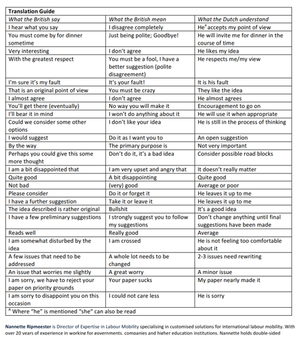

January is the month when many companies [reset OKRs](https://unlockokr.com/okr-goals/) and expend considerable effort to align all of the department and individual goals with the company strategy. Our CEO also kicked off an initiative with a **Culture Roll Out Town Hall** this past week. The main message was to be ready when the new training is cascaded down through the hierarchy, and to become more customer centric in the way we deliver our work. I for one am super excited to be included in the process this year. 

You might have inferred that there were questions that dogged me through 2021 that prompted me to open this forum. If you've followed my writing through twenty-odd posts over the past year, you should be excited about the **Culture Roll Out** too. I've [talked about teams and managing your manager](https://jimgruman.netlify.app/post/2021-05-28-data-evangelist-part-13/) and ventured into [educating leaders on what is possible](https://jimgruman.netlify.app/post/2021-05-14-data-evangelist-part-11/). I've written on [open source, credibility, and trust](https://jimgruman.netlify.app/post/2021-05-07-data-evangelist-part-10/) in the marketplace of ideas. I've written on the contributions of [generalists](https://jimgruman.netlify.app/post/2021-04-09-data-evangelist-part-7/) and the need to build empathy and leverage connections, and the [hidden costs](https://jimgruman.netlify.app/post/2021-04-09-data-evangelist-part-7/) of choosing to outsource analytics capabilities.

Whatever prompted you to read the blog post this time, buckle up for about 18 minutes of reading.

-----
## The Culture Map

I have a dog-eared copy of Erin Meyer's 2014 book that I pull back off of the shelf from time to time. Over-generalizing cultural norms and labeling other people before getting to know them is dangerous. Never make assumptions about individual traits based only on where a person comes from. 

There the oft-told story of two young fish that encounter an older fish swimming the opposite way. He nods at them and says, "Morning boys, how's the water?" which prompts one of the young fish to ask the other, "What the hell is water?" When you are in and of a culture, it is often difficult to *see* that culture.

Thinking back through a long career, I find it useful to reflect on my own leadership style in the context of working with others internationally. Yes, I do tend to fit the label of an American egalitarian, with the overly quick decisiveness and bounded persuasion tendencies described in the book. 

I have an aversion to writing Power points with bullets. They strip the humanity out of ideas; they turn thoughts tactical, into “action items;” they make every message a one way brief, condescendingly meant to convey that the reader doesn't have to take the time to understand now, or to interact with the presenter. Bullets are devoid of context, snappy takeaways without supporting evidence, all chorus and no verse.

But, as I was reminded by [Benn Stancil's newsletter](https://benn.substack.com/p/service-pressure), bullets have their place. When people are upset, irritated, or just want to read the recipe without slogging through an indulgent preamble about cycling, they need bullets. Reluctantly, I have to admit that Benn is right. 

Erin Meyer's Culture Map offers pointers for teams working through ambiguity, even chaos. How much engagement should happen with the boss, and the bosses boss? Will bonds of loyalty with an employee supersede an outside consultant or a contractor? I will note here that the large global consultancies like BCG and McKinsey do a good job of curating and exploiting accumulated knowledge across all of their clients, globally. They get it. 

Meyer's book is too long and out of date to be a handy desk side reference, but I went back specifically to re-read Chapter 2 on **Communicating** and Chapter 4 on **Leadership, Hierarchy, and Power** before my annual performance review. There's a lot to unpack in reading between the lines communicating across cultural boundaries. You might be considered a top-flight communicator in your home culture, but what works at home may not work so well with people elsewhere. There are cultures that place a higher value on titles, like the **Director of the Centre of Excellence of XYZ**, along with the size of an office's windows and a ficus tree. Only in the low-context cultures is the direct, explicit written performance assessment of how each person is doing widely accepted. Many Americans value candor and institutional transparency, and if you score poorly you would expect detailed context, else doubts would linger about the company's leadership capacity and integrity.

Meyer re-tells the story of an announcement made by British Airways pilot Eric Moody in 1982, after flying through a could of volcanic ash over Indonesia: "Good evening again, ladies and gentlemen. This is Captain Eric Moody here. We have a small problem in that all four engines have failed. We're doing our utmost to get them going and I trust that you're not in too much distress, and would the chief steward please come to the flight deck?" Imagine the varied reactions from all the passengers. The story did end well, as the pilot was able to restore power and safely land.

-----
## Customer Needs

Vin Vashista sounds a dire warning in his post [Zillow Was Just The Beginning. Companies Are Feeling The Pain Of Failed Data Science Initiatives](https://vinvashishta.substack.com/p/zillow-was-just-the-beginning-companies). The Zillow-Offers real estate unit's debacle highlights a growing problem for the field. He argues that Data Science initiative failures are even more rampant in mature companies, even with capable teams. 

Zillow decided to eat their $380 million loss all at once. They disclosed it and dropped the business unit altogether. Better to be done with the initiative than let it drag out over years. The same sorts of events are playing out in other companies more slowly and privately.

### Failure To Successfully Deploy A Platform

Zillow wasn't the only recent platform failure. IBM launched Watson years before any other Machine Learning based platform. IBM oversold Watson's capabilities from the earliest days. Its appearance on Jeopardy was spun into promises of applications across industries. Those never came to pass simply because Watson could not deliver. Watson Health was pushed into hospitals before it worked as well as they promised it did, or more importantly, as well as customers expected that it would. Within two years, many of those early customers uninstalled Watson. The sale of Watson Health this month brings this tale to a close. 

To be sure, all the other companies that deployed AI platforms faced early challenges. Amazon, Microsoft, and Google all overcame what IBM could not. Microsoft certainly faced challenges in the early days of Azure. It was an ugly failure, and they knew they had to make big changes. IBM worked on their issues from a technology perspective. Microsoft realized the problems started at the business level.

Microsoft changed leadership and the business model around Azure and built a strategy-first, customer centric approach. The reorganization was expensive and painful. It took buy-in from the top and discipline. Azure's subsequent success allowed Microsoft to make its next move from cloud to AI. Again, this required organizational change. Again, they have achieved success.

AI requires both strategy and organizational agility to be successful. The business alignment is as important as the technology and Data Science team's capabilities. IBM and Microsoft had dramatically different outcomes because one realized that while the other did not.

### Failure To Apply Data Science For Revenue Growth

Netflix's share prices took a beating this past month. They are seeing a slowdown in subscriber growth, and its stock has been dropping in response. In contrast, Amazon and Facebook realized subscriber growth has an upper limit. They wouldn't always be able to rely on just adding new subscribers for growing revenues. From Sage Maker to Alexa, Amazon has monetized other dimensions of Machine Learning to drive growth when subscriber numbers stalled. Facebook leverages Machine Learning to keep users on-platform longer. Revenue growth comes from increasing the revenue per user, so revenue growth did not decrease when user growth slowed.

For any company to be successful in this space, there must be a monetization strategy. The quiet Data Science initiative failures at Netflix are a lack of new paid features supported by the core technology. They haven't found ways to open business models or improve their monetization of existing customers.

Success in the enterprise is measured by well how *customer needs* are fulfilled (profitably, etc). If your work agenda is not going to make tangible differences in customers' experiences, your fate for the year is set. These are not apparent Data Science failures until you compare companies struggling to companies succeeding. The difference in outcomes exposes Zillow-type failures across many businesses.

### Failure To Apply Data Science To Optimize The Business

Supply chain disruption has been a recurring theme for almost 18 months. Companies like Apple have used Data Science to make their supply chain more resilient. Intel and GE have not.

Apple saw this coming just like everyone else did. Tim Cook said these issues are impossible to resolve completely, but their team did everything possible to put Apple in the best position and prevent further impacts to growth. This most recent quarter's earnings beat expectations and showed a decreasing impact from supply chain issues on deliveries.

Among Apple, GE, AMD, and Intel, these companies all had best-in-class in-house Machine Learning capabilities. Failures are eye-opening because they show how even capable businesses can fail. It is not enough to simply hire Data Scientists and take on the technology. There is a strategic component to success. Companies must build their business and operating models around monetizing the innovations.

Here again, successful organizations are built to deliver solutions to fill customer needs. Data Science fails on an island. Capability, product, and functional silos must be broken down. Businesses either prepare users for Machine Learning based products, or they will not adopt them. The effort will be wasted. 

On the surface, outsourcing data science projects is tempting, with glamorous upsides and little apparent downside. Task someone with porting all the accumulated knowledge from consultancies, that have vibrant communities of practice and knowledge systems, to the incumbent organization. Sadly, in practice the documents fill a file cabinet, but little else changes to deliver on customer needs. The outwardly visible consequences of Data Science initiative failures may not be obviously connected. They look like past failures, and it is easy to assume the root causes are the same now as they were before. As in past years, we fire the contractor, then move on.

In the coming year, many data science practitioners will be taking bigger risks, building decision tools on data, making incumbents very uncomfortable. It means taking even personal risks, learning new things. An analyst's value may not be realized as they grow until they leave their current role. It’s the nature of this work as evidenced in the great resignation of 2021 across this and other professional fields.

-----
## Upcoming Events

These are opportunities to engage and learn about analytics, data science, and AI from peers.

:star: February 1 [Capacity Planning for Microsoft Azure Data Centers](https://www.meetup.com/RStudio-Enterprise-Community-Meetup/events/282661442) online

:star: February 8 [Metrics Stores vs Feature Stores](https://www.meetup.com/Data-Science-DC/events/282785487) online

:star: February 9 [Retail Analytics & Business Intelligence with Google Looker, BigQuery, and GCP](https://www.meetup.com/Serverless-Toronto/events/281002271) online

:star: March 21-24 [NVidia GTC 2022](https://www.nvidia.com/gtc/) online AI Developer Conference

:star: April 3-5 [INFORMS Business Analytics Conference](https://meetings.informs.org/wordpress/analytics2022/)

:star: June 3-4 [R/Finance Conference](https://web.cvent.com/event/2efa4ed6-5d94-44cf-9c15-e0ae8d78276e/summary) at the University of Illinois at Chicago

:star: June 9-10 [New York R Conference](https://rstats.ai/nyr/) workshops and conference, online and in-person

:star: June 20-23 [useR!2022](https://user2022.r-project.org/) Online Global Conference

----
## Data Lives

Data Lives is the latest collection of scholarly analysis, biography and fiction from prolific author Rob Kitchin. He reflects on how schools, governments, and other public institutions all over the world are grappling with how best to drive themselves with data on their missions, to become more business-like.

Who is to benefit from the decision tools and choices of kpi metrics, and who is going to made to look like a fool for not having exploited that knowledge to serve the public?
 
### Customer Centricity
 
A key question for the data-driven age is how do we ensure that the development of digital tech is truly user-centric? That they are created and used in the best interests of the producers of that data? That users are actively involved in decision-making concerning their design and deployment? And that the users involved are representative of the wider population and their interests? These questions are not easy to answer, especially given that there are dominant vested interests that always seek to protect their data power. What is needed yet in 2022 is an ideological shift in how society approaches the creation and use of technology. 
 
Kitchin's aim in writing the book was to shine a critical light onto the nature and the life of data and to chart the rapid unfolding and impact of data-driven technologies, processes, and practices on how we live our lives. What is revealed is that up to relatively recently, we have focused little conceptual and critical attention to data themselves. Instead, we have tended to think about and treat them in quite technical terms: focusing on how to collect, handle, process, analyze, store, and share them. Data were understood to be the building blocks for information and knowledge, and what critical attention were paid to them generally concerned issues like access. Just in the last couple of decades it has become apparent that data are not ever simply a raw material to be mined. Rather, data are produced in a context, in a life cycle infused with a range of factors. Data are cooked and are contingent and relational; mutable under the conditions of their production and use.

### The tech support agent

During my time on the 4WD tractor platform we had market segments with customers operating at high performance boundary conditions that warranted in-season in-person visits. I found myself assigned to take my turn to make trips, and on that engagement to become the product support agent.

I stayed involved long enough to work with the wider product support community. In doing so, I had a chance to learn from far more talented support experts than I ever would be. Sitting in the trenches together with frustrated customers, they didn’t just teach how to close out a ticket. They showed how to handle the pressure of an infinitely scrolling to-do list. They showed how to diagnose a problem, how to listen, how to talk to someone who’s frustrated, and how to mediate without taking sides. They taught that support, like sales, is a job everyone should do at least once. All of this, frankly can make us better analysts. 

They also taught that, sometimes, you must use bullets. No dealer technician wants an essay from their support agent, nor do they want graphs. Instead, they want clear instructions, with the important points highlighted, and the relevant details. So, in honor of that lesson these are the other things that the support team taught, in all their formatted, bulleted, bolded glory.

### Be a Detective, not a Consultant

When a customer reports a bug, production is whatever is on their screen. No matter what should be happening, no matter what’s happening when you try to reproduce it, no matter what the code says, no matter how little information they give you, their problem is the problem to fix. 

The same applies to analytics. As [Randy Au eloquently put it](https://counting.substack.com/p/the-many-faces-of-production), production is what’s in people’s heads. It doesn’t matter how it got there or if we believe it to be wrong. They think it; therefore, it is. Our job, first and foremost, is to uncover more:

- Sometimes, we find out that we are the ones who don’t know something. For example, we may think that Facebook ads are ineffective, and think that all the sales reps who prioritize leads from Facebook are making a bad decision. But the problem might be that we’re not doing marketing attribution correctly, and it’s us who’s wrong.

- Other times, we realize that some bit of tribal knowledge, like “our blog drives traffic but not signups” stems from a years-old deck that grew, through email and office chatter, from an interesting offhand finding to an Iron Law of the Universe. These beliefs can’t simply be corrected; they have to be unwound. To do that, we need to know where they came from.

We can’t do either of these things if we act as consultants, charged with imposing our expertise on the unenlightened masses. Instead, analysts must model themselves after detectives who don’t seek to correct others’ experiences, but to understand them. And just as a detective (and a support agent) would never tell a witness they’re wrong, neither should we. We should instead say, “that’s interesting; tell me more.”



### People Want to be Seen

In Benn Stancil's excellent post on [Service Pressure](https://benn.substack.com/p/service-pressure), he reports once being told by a senior leader that the biggest complaint users have about support teams is that they don't listen, and they don't understand users’ businesses. For these users, being told no was fine; they knew their questions were sometimes unreasonable, and their new feature requests were unrealistic. But being rejected offhand, before they had a chance to explain what they wanted and why it was important to them was unforgivable. 

Great support teams understand this. They understand that, often, customers just want to be heard. They’re frustrated by a bug and they want someone to validate that emotion. They’re excited about an idea and they don’t want to be demoralized with a quick dismissal.

As an analyst, remember that this also applies to the questions people ask of data teams. When people come to data teams with bold ideas that we know won’t work, it’s tempting to immediately dash their dreams with "*we tried this before and it didn’t work, we can’t get that data, and even if we could, it couldn’t be interpreted that way.*"

This misses the point. People usually don’t want a model that precisely predicts which customers' credit applications are going to land in a given month; instead, they want the data team to understand that late payments are causing trouble. They want us to see their problems as much as they want us to solve them.

### We don’t have to be Smartest Person in the Room

Next time you’re sitting in a meeting, take a moment to ask yourself what you want people to think about the next thing you say. Do you want them to be inspired? To laugh? To feel supported? To see you as being organized? To see you as being in charge?

For a lot of analysts, if we’re honest with ourselves, our answer is that we want people to think that we’re smart. We’ve been conditioned to believe that, above all else, our cultural capital comes from our intellect. Better to be a prickly truth teller than a hyperbolic leader or a passionate manager. 
On a support queue, however, nobody cares how smart you are. On the contrary, the best support agents deflect their own cleverness back onto the customer. 

For example, at a hardware company, their customers tended to put the batteries in products incorrectly, but people reacted poorly when support agents asked them to check if they’d messed up something so simple. So the support team devised a strategy: Tell the customer the problem can sometimes be resolved by taking the batteries out and putting them back in. When customers did this, they’d notice the batteries were wrong, but could do so so without having to admit to the mistake they’d made. 

The natural inclination with engineers is to want to take credit for solving the problem. You want the customer to know that you knew what was happening all along. You want them to know that you were smart enough to figure it out. 

Just let it go. Give the customer the win; take the glory to the grave. For data teams, our job is the same: Help people solve problems. We should be satisfied by good results and by happy coworkers; we don’t need to measure our worth by how smart they think we are too.

Data teams operate in the spaces between teams and competing opinions, and are often called upon to indirectly mediate internal disagreements. But data teams aren’t [disinterested observers](https://roundup.getdbt.com/p/saying-true-things-is-hard): They’re invested in the business, and likely have personal relationships with people on both sides. Support teams offer a potential solution: Be everyone’s stern therapist. Listen, give people emotional space, tell the facts straight, and most importantly, recognize that none of this is about you. The customer isn’t mad at you; they’re just mad. 

### Take Pride in Maintenance

Product support teams get frustrated with how little they get done every day. They arrive in the morning, talk to customers, close out tickets, and return the next day to a fresh batch. Aside from gradually expanding the knowledge docs, they seemingly build nothing, as if running on a treadmill. 

We should take more pride in that work. We appreciate airplane pilots that fly back and forth along the same routes every day; we celebrate chefs who cook food that needs to be made again tomorrow night. These jobs are no less important than those of the idolized builders; they’re just shaped differently. 

Data teams should remember this as well. We often chase big projects, like launching a new testing platform, building a new pricing forecast model, or finally refactoring the core codebase. But the value of this work doesn’t discount the value of analytical maintenance. That is, keeping the critical dashboards up, making sure operational teams have quick access to information, and of reliably publishing the news.

By rejecting the identity of a service organization, we turn our queues of requests into to-do lists, a looming backlog to burn down before we can get to the bigger, more meaningful stuff we’re supposed to be doing. But there’s something to be said for embracing the service role. Our backlogs are inevitable, and a service mindset can turn those requests into routines; they can become weekly work that isn’t an ante to do something better, but a healthy habit to be celebrated.

Just as a support team will never finish their work on the queue, we’ll never be done with maintenance. We can’t change that. But we change how we see it, and how we value ourselves on the days that we do it. 



----
## Book Recommendation

and a related podcast with the author

<iframe style="width: 100%; height: 200px;" frameborder="no" scrolling="no" seamless src="https://player.captivate.fm/episode/cbf59097-7fa6-4cd1-b632-23ad32d0ca4b"></iframe>

Aubrey Clayton is a mathematician in Boston who teaches the philosophy of probability and statistics at the Harvard Extension School. He holds a PhD in mathematics from the University of California, Berkeley, and his writing has appeared in Pacific Standard, Nautilus, and the Boston Globe.

He talks about what he deems “a catastrophic error in the logic of the standard statistical methods in almost all the sciences” and why this error manifests even outside of science, like in medicine, law, public policy, etc.

----
## Related posts

Significant segments of this post were built from ideas in Erin Meyer's Culture Map, Benn Stancil's Service Pressure post, Randy Au's Faces of Production post, Vin Vashista's Zillow post, and Rob Kitchin's Data Lives. The cover is a [John Cutler tweet](https://twitter.com/johncutlefish/status/1487161957916430337) that he confirms is his creation.

[the last post of the Data Evangelist series](https://jimgruman.netlify.app/post/2022-01-14-data-evangelist-part-19/)

-------

### Did you find this page helpful? Consider sharing it :raised_hands: