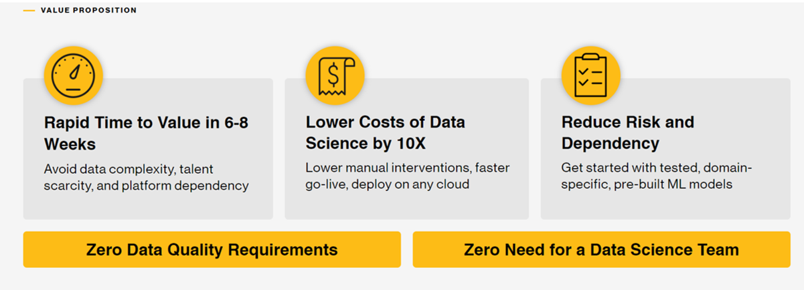

This year's in-person face to face cultural training drove home 1) how diverse groups need clear definitions and meaningful illustrations of core guiding principles and 2) how much we need a forum for group change therapy, post-COVID. It made me so very happy to hear others say what I was only thinking, but not sure that I could express. I've collected a handful of thought fragments over these past weeks, and the one idea that links them together is the concept that we as individuals, in each of our choices, create culture ourselves.

So, yes, our extended team has a fresh, new mandate to not only think, but also to take action in new ways.

> [Your mission, should you choose to accept it](https://www.imdb.com/title/tt2381249/), is to tell 2 positive focused stories and write 3 positive focused recognitions each and every week. 

This is going to be harder than it looks on the surface, and will require practice. If I take this goal seriously, I am certain to become a better person and a better professional. It might or might not move the needle on "annual" performance goals (set in April, assessed in October :star: ). Whatever prompted you to read this short blog post, I hope that you come away with a handful of useful insights for your own work. Your feedback is welcome.

----

I had a chat last week with management at a major company in the autonomous vehicle development space, and a director noted a concern that their machine learning engineers tend to optimize for "keeping their GPUs warm" (that is, running all sorts of experiments to explore any combinations of ideas), and not necessarily optimizing for the business-critical customer performance measures, which should be coming from careful consideration of the best modeling choices given the nature of the data & the task at hand.

I understand how the “move every mountain” sense of urgency on these teams would incentivize experts to consume every clock cycle and every dollar of budget made available to them. Orchestrating every possible experiment is not easy. There's a high cognitive overhead to keep track of everything and embarrassingly long turnaround times from requirements documentation to "final" solutions.

Should we reward teams that pause to think about simplifying the process, rather than wait days for the computer to run every hyperparameter? The growing AutoML hype exacerbates the problem by perpetuating a narrative that we should automate away the pain of choosing models and instead push ML practitioners to click the train button. A consequence is that ML practitioners end up mindlessly plumbing pipelines to & from AutoML systems, GPUs are whirring around the clock, and fewer people pause to focus on step function improvements in decision quality. Maybe AutoML can find the one great model for a specific, previously solved, dataset, but the reality is data is always changing, and eventually teams realize at some point that a talented ML practitioner needs to develop the intuition for the task, and developing intuition requires Exploratory Data Analysis, thought, care, critique, and the rest of the data science tool stack.

[AI projects need rigorous decision makers more than any other role](https://medium.com/hackernoon/the-decision-makers-guide-to-starting-ai-72ee0d7044df). Why? If the team lacks the skills to set clear success metrics at the beginning, there is no point in all of the beautiful machine learning modeling. If teams don’t have the capability to self-organize & self-manage (yet), then they’re not ready for agile. In the hands of competent decision makers, scalable technology can help solve many of the biggest problems we face. Otherwise, the money is certain to be yet another Proof Of Concept up in smoke.

----

A long time ago I attended an emeritus engineer's talk where he ruminated on a history of building stuff in the “let’s build a tractor” sense. Along the way he made an offhanded comment that stuck with me: the phrase “no one’s done this before.” Want a tractor that runs on diesel fuel? Want to have it have a comfortable cabin or drive on rubber tracks? The interesting projects all have some aspect that hasn’t been done before.

I think that it provides an interesting perspective about how we as data scientists view our work and the contribution of the profession. In any field, there are people who are considered “at the cutting edge.” Maybe they’re a leading researcher. Maybe they’ve been around a long time and have deep knowledge, insight, and connections. Maybe they created or maintain a famous open source tool that everyone uses and continues to make contributions to it.

Naturally, we look up to those leaders. They’re high status, have a sort of social capital, and are very visible. Very often they’re doing “new and cool things” and their interests provide a guide of where the “cutting edge” of data science is — either through the things they’re working on, or projects that they become aware of and share due to their position and status. At least from a the broad public’s point of view, these people are moving the field forward.

But the problem with comparing ourselves against them is that they seem distant from us. We spend much our time pulling data out of a warehouse in SQL, dumping some analysis with code into a spreadsheet, doing simple tests to generate charts and insights, then ship out Powerpoint decks. I know tons of people who are doing very similar things too. That’s miles and miles away from the apparent “cutting edge”. It’s easy to feel that we’re just followers that aren’t really making contributions to the field. This easily feeds into imposter syndrome.

I’m here blogging to make the argument that there’s a neglected side of “cutting edge” work — the applied/execution part — and more of us could be nibbling at the edges of that frontier.

### Theory and execution are separate things

[Randy Au writes](https://counting.substack.com/p/youre-probably-on-the-cutting-edge?s=r):

*Humans are really really good at making stuff up with theory. We can “solve” tons of problems in our minds. We’re also really good at generalizing our knowledge — once you know how to make a simple soup (meat + veggies + salt in water then boil) we can easily imagine how to make chicken soup, minestrone, or even chowder without having to actually do it.*

*But just like with making soup, theory and execution are different things. While it’s true you can just throw food in a pot and boil to make a kind of soup, you can make a significantly tastier soup if by tuning the cooking technique and selecting for the best ingredients. Tough cuts need to be handled differently, certain meats can be a bit smelly or oily unless handled in certain ways, some spices don’t go together, and so forth. To get to that level either requires learning even more cooking theory, or a direct practice that accumulates experience.*

It is difficult to completely “book learn” your way to dinner.

*Despite that, there are people who turn up their noses on “solved problems” in the sense that if we know in theory how to do something, it’s not particularly interesting or considered cutting edge any more. For example, optical character recognition (OCR) has been around for decades and is pretty reliable in a lot of contexts, and some would say “just load up the tessaract package and it’ll do everything for you! Easy!”.*

*But ask anyone who’s tried to implement even “well understood” solutions realizes, things are never that easy. The execution of solutions within every unique context can be ridiculously challenging. There is no single book, or web site, with all of machine learning or MLOPs. OCR is “easy” until you have to do it within milliseconds, or with bad lighting, or a mix of languages, or scribbled handwriting, or done on a tiny battery-powered device with limited CPU. Analyzing “churn” is very often a linear regression problem, but wrangling the data to that point can take a great deal of work.*

The practical challenges are real, and rarely addressed in either any consultant's sales material or in academic settings. (see also "Zero Need for Data Science Team" above). The “interesting stuff” is already done, the rest is left as an exercise to the reader. The people who do deal with the ugly problems typically work in industry, and industry is usually not motivated to share their work, let alone write an open source package or publish about their “secret sauce”. *Our behavior, in industry, when left without strong incentives to do so, is most often to fail to collaborate.*

The resulting situation is interesting, that the “true” cutting edge of data science is somewhere out there in **vague gesture into the void**, but few have seen it. Like in [Matt Might’s illustration about an individual PhD’s contribution to knowledge](https://matt.might.net/articles/phd-school-in-pictures/) we are each only  creating a tiiiiny bump along the frontier.

Through this lens, the “club” of being out in the forefront of the field is hilariously easy to join because the entire surface area of the problem space is extremely wide and relatively accessible. Our tools are **open source** and free. Much of our work results in knowledge and software — stuff that’s infinitely copyable. The data community loves sharing tools, talks, and blog posts with each other. Stuff can go viral overnight. All it takes is being willing to share work with the rest of the community. If it somehow resonates with the community in some way, you’ve likely nudged the frontier of data science out just a little further.

----

## Outsourcing Analytics

Why do companies use external providers for data and analytical services that they can produce themselves?

[Orestis Tsinalis](https://twitter.com/orestistsinalis) writes:

*The good reason: External providers may have expertise you don’t have, in either some specific data related to your business or in some analytical methods that you don’t know or cannot source.*

Unfortunately, the good reason above is usually a very small part of the story.

*To understand how the choice of external providers (vs creating and retaining IP internally) works, look no further than corporate politics.*

*Maybe the data and analytical expertise exists, just not in “that senior stakeholder’s” sphere of control.*

*What happens then? Internal data science teams are pitted against the external provider mostly as a pricing gauge, leading to either burnout or demoralization for the poor data scientist that is pitted against a whole company.*

*There is nothing more demotivating than “competing” with external providers. If you are an experienced data scientist chances are that you are capable of generating IP for the company you work for. Bringing some external company to destroy that opportunity is frustrating.*

*In a world driven by data, having a data science team as a tool for pricing and validating external providers is a waste of resources no matter how much money you think you are saving.*

*You are in the data business, you just don’t know it until a data business eats your lunch.*

-----
## Upcoming Events

These are opportunities to engage and learn about analytics, data science, and AI from peers.

:star: June 3-4 [R/Finance Conference](https://web.cvent.com/event/2efa4ed6-5d94-44cf-9c15-e0ae8d78276e/summary) at the University of Illinois at Chicago

:star: June 9-10 [New York R Conference](https://rstats.ai/nyr/) workshops and conference, online and in-person

:star: June 20-23 [useR!2022](https://user2022.r-project.org/) Online Global Conference

:star: July 25-28 [rstudio::conf(2022)](https://www.rstudio.com/conference/)

:star: October 16-19 [INFORMS Annual Meeting](https://meetings.informs.org/wordpress/indianapolis2022/)

-------

### Did you find this page helpful? Consider sharing it :raised_hands: