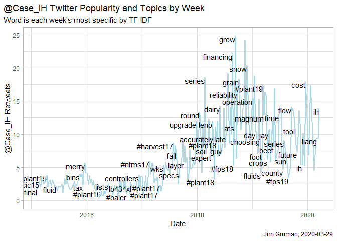

The R for Data Science online learning community (R4DS) hosts a wonderful program each week to practice data visualisation skills in R: [Tidy Tuesday](https://github.com/rfordatascience/tidytuesday). Simply make your plots based on the data provided, and then share them on Twitter along with the code and the hashtag #TidyTuesday. 

----
[What is TidyTuesday?](https://github.com/jthomasmock/tidytuesday_presentation-user-2020/blob/master/)

According to [Thomas Mock](https://themockup.blog/posts/2020-12-31-2020-in-review/), it is a **scaffold** for a **self-directed community of practice** in mastering data visualization. 

In education, scaffolding refers to a number of instructional techniques used to move students progressively toward stronger understanding and, ultimately, greater independence in the learning process.

A community of practice is a living, voluntary group of people that share a passion for something they do and learn how to do it better as they interact regularly.

----
Here are my ten reasons to dive in: 

    1. Be inspired by the creativity of others 
I love to see the variety of visualizations coming from the same data sets. On most weeks, there is at least one Tidy Tuesday plot that uses an approach I would not have thought of. Fortunately, most authors share their code. This is an easy way to learn cool new tricks. 



    2. Discover new functions and packages 
Tidy Tuesday is a perfect opportunity for exploring new packages at low risk. I learned about the `gganimate` package here, to make animated GIFs. This can be helpful in some contexts to show trends over time. Another package I first used for Tidy Tuesday is `ggrepel`, to add labels to a subset of data points, making sure that the labels do not overlap any points or other labels. Last week my discovery was `ggbump` for plotting changes in ranking over time.

    3. Learn to make plots self-explanatory 
What message does the graphic need to convey? Every week, I challenge myself to make my #TidyTuesday plot as clear as possible. The goal is to make a stand-alone image that can be understood without additional information. I try to focus on one message at the time. Labels, colors, titles, and captions can be applied to draw attention to specific parts of the plot. 

    4. Practice tidyverse skills 
Tidy Tuesday also creates opportunities for hands-on experience with the tidyverse. The tidyverse is a meta-set of several R packages, with `dplyr` and `ggplot2` the most popular. Many of the Tidy Tuesday data sets are raw and require manipulation to uncover insights.
 

    5. Learn to fine-tune graphs 
`ggplot2` is the graphics package of the tidyverse. Almost everything can be adjusted in a `ggplot`: for example, the text font, size, position, and alignment. You can change the position and appearance of the legend, and much more. If you use color in the graph itself, there are many color palettes and themes. Having control over the details means you can make your data visualization more powerful. 



    6. Discover new data sets every week 
I can get complacent sometimes, working in one or two domains with the same, previously perfected, formulaic templates. Fortunately, Tidy Tuesday provides fresh new material each week. The challenge here is to put something new out there, rather than sitting on it and trying to make it perfect. There are vast resources available to enhance the analysis, like geospatial mapping, imdb movie reviews, text sentiment, and so much more. Having a busy week? You can always take a break and jump in again next week. New data is usually posted on Monday or early Tuesday morning. Despite the name, don’t limit yourself to Tuesdays. Any day is perfect to post a #TidyTuesday graph to Twitter! 

    7. Become a part of the `#rstats` Twitter community 
The community is friendly to beginners. If you mention you are participating in Tidy Tuesday for the first time, you will most likely get a warm welcome. I love to see first-time participants contributing to the community. You can always ask for feedback on your plot and get useful suggestions. 



    8. Explore interesting data sets 
Tidy Tuesday data sets have covered the Office, fast-food calories, airline safety, alcohol consumption, pets, Animal Crossing, and others. If you are looking for a data set to explore and practice with, you can pick one from the list of previous data sets. 

    9. Try different plot types 
There are so many types of graphs – line graphs, bar graphs, box plots, violin plots, heat maps, dot plots… The [R graph gallery](https://www.r-graph-gallery.com/) gives an overview of the many different visualisation types available. Not all types will be suitable for each data set. However, with the variety of Tidy Tuesday data sources you will eventually get to try pretty much all graph types. 

    10. Get inspired to tidy up elsewhere
Watching others on their learning journey also inspires me to dedicate time to organize and improve my own skills. Learn by learning about learning. [Neal Grantham](https://twitter.com/nsgrantham) follows all TidyTuesday submissions at [tidytuesday.rocks](https://shiny.rstudio.com/gallery/tidy-tuesday.html). Take a moment to check out the work of data visualization pros, like [Cedric Scherer](https://twitter.com/CedScherer), [David Sjoberg](https://twitter.com/davsjob), and [Georgios Karamanis](https://twitter.com/geokaramanis).

> Inspired by [Veerle van Son's Surrounded by Data blog](https://surroundedbydata.netlify.app/post/tidy-tuesday/)

If you want to join the fun, go to the [Tidy Tuesday GitHub](https://github.com/rfordatascience/tidytuesday) page to read more and get this week’s data. If you are already participating in Tidy Tuesday, what do you like about it? What have you learned? 

### Did you find this page helpful? Consider sharing it 🙌

