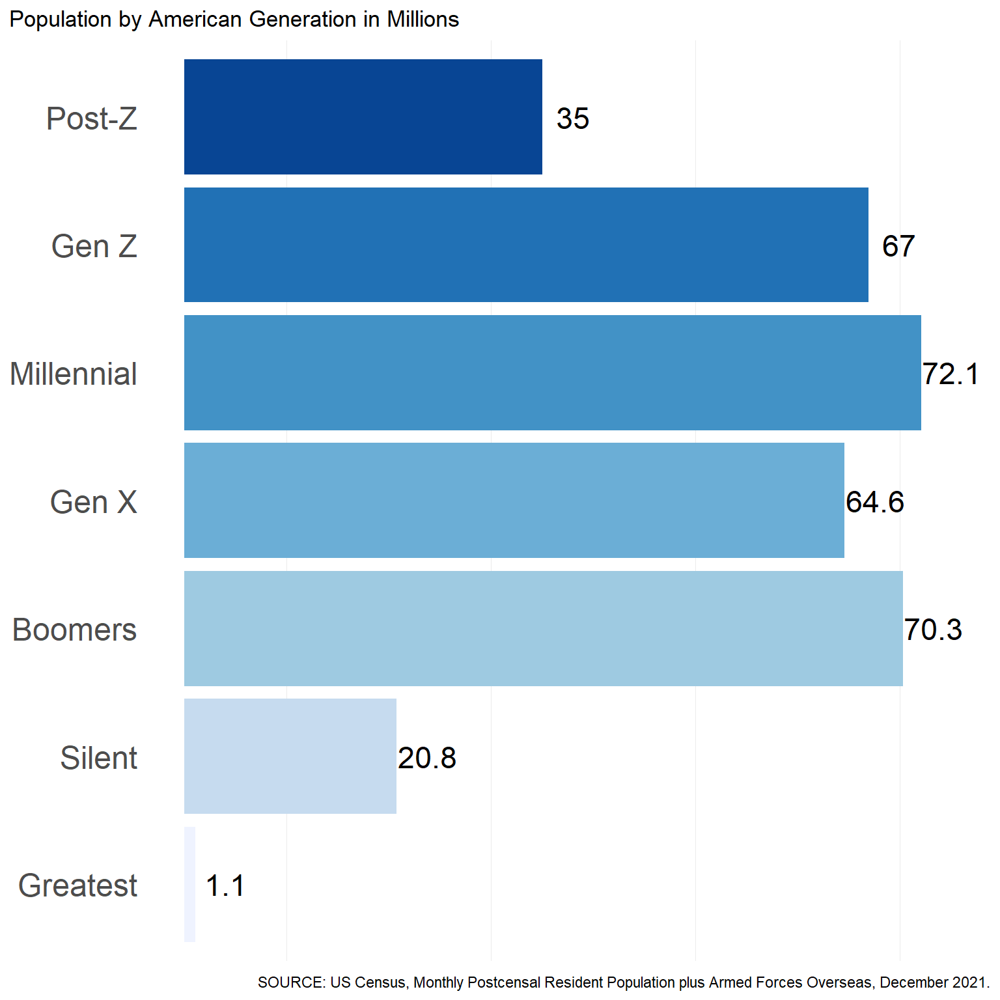

<link href="index_files\libs/lightable-0.0.1/lightable.css" rel="stylesheet" />

Inspired by

> Jason Timm's [post on Seven Generations of
> America](https://www.jtimm.net/posts/seven-generations/)

> Kyle Walker's [Analyzing US Census
> Data](https://walker-data.com/census-r/index.html)

> The `tidymodels` [Multi-scale model assessment with
> spatialsample](https://www.tidymodels.org/learn/work/multi-scale/)
> vignette by Mike Mahoney

Let's have a look at the composition of American generations with Pew
Research definitions and US Census data. By the end of this post, we
should have a perspective on a few tools for exploring the changing
demographics of America. This document was authored in RStudio in a qmd
Quarto file using the R language and several open source packages, and
is publicly available [here](https://github.com/opus1993/pubrepo).

Four of America's seven living generations are more or less complete and
only getting smaller: `Greatest`, `Silent`, `Boomers`, and `Gen X`. The
generation comprised of `Millenials` is complete as well, in that it has
been delineated chronologically; however, the group continues to grow
via immigration.

<table class="table table-striped table-hover table-condensed" style="width: auto !important; margin-left: auto; margin-right: auto;">
<caption>Pew Research Definitions</caption>
 <thead>
  <tr>
   <th style="text-align:right;"> rank </th>
   <th style="text-align:left;"> gen </th>
   <th style="text-align:left;"> range </th>
  </tr>
 </thead>
<tbody>
  <tr>
   <td style="text-align:right;"> 1 </td>
   <td style="text-align:left;"> Greatest </td>
   <td style="text-align:left;"> &lt; 1927 </td>
  </tr>
  <tr>
   <td style="text-align:right;"> 2 </td>
   <td style="text-align:left;"> Silent </td>
   <td style="text-align:left;"> 1928-1945 </td>
  </tr>
  <tr>
   <td style="text-align:right;"> 3 </td>
   <td style="text-align:left;"> Boomers </td>
   <td style="text-align:left;"> 1946-1964 </td>
  </tr>
  <tr>
   <td style="text-align:right;"> 4 </td>
   <td style="text-align:left;"> Gen X </td>
   <td style="text-align:left;"> 1965-1980 </td>
  </tr>
  <tr>
   <td style="text-align:right;"> 5 </td>
   <td style="text-align:left;"> Millennial </td>
   <td style="text-align:left;"> 1981-1996 </td>
  </tr>
  <tr>
   <td style="text-align:right;"> 6 </td>
   <td style="text-align:left;"> Gen Z </td>
   <td style="text-align:left;"> 1997-2012 </td>
  </tr>
  <tr>
   <td style="text-align:right;"> 7 </td>
   <td style="text-align:left;"> Post-Z </td>
   <td style="text-align:left;"> &gt; 2012 </td>
  </tr>
</tbody>
<tfoot>
<tr>
<td style = 'padding: 0; border:0;' colspan='100%'>a https://www.pewresearch.org/fact-tank/2019/01/17/where-millennials-end-and-generation-z-begins/</td>
</tr>
</tfoot>
</table>

While `Gen Z` has been tentatively stamped chronologically by the folks
at Pew Research, only about half have entered the work force. And though
we include them here, the `Post-Z` generation is mostly but a twinkle in
someones eye; half of the group has yet to be born.

### Monthly US population estimates

The *Monthly Postcensal Resident Population plus Armed Forces Overseas,
December 2021* is made available by the US Census
[here](https://www.census.gov/programs-surveys/popest/technical-documentation/research/evaluation-estimates/2020-evaluation-estimates/2010s-national-detail.html).
The census has transitioned to a new online interface, and this
particular file is built off of some of their projections.

A more detailed description of the population estimates can be found
[here](https://www2.census.gov/programs-surveys/popest/technical-documentation/file-layouts/2010-2018/nc-est2018-alldata.pdf).
Note: Race categories reflect non-Hispanic populations.

The following table details **a random sample of the data set** -- with
Pew Research defined generations & estimated year-of-birth.

<table class="table table-striped table-hover table-condensed" style="width: auto !important; margin-left: auto; margin-right: auto;">
<caption>Seven Sample Census Data Lines with Pew Generational Definitions</caption>
 <thead>
  <tr>
   <th style="text-align:left;"> gen </th>
   <th style="text-align:left;"> range </th>
   <th style="text-align:left;"> race1 </th>
   <th style="text-align:right;"> yob </th>
   <th style="text-align:right;"> AGE </th>
   <th style="text-align:right;"> pop </th>
  </tr>
 </thead>
<tbody>
  <tr>
   <td style="text-align:left;"> Gen X </td>
   <td style="text-align:left;"> 1965-1980 </td>
   <td style="text-align:left;"> Asian </td>
   <td style="text-align:right;"> 1975 </td>
   <td style="text-align:right;"> 46 </td>
   <td style="text-align:right;"> 290698 </td>
  </tr>
  <tr>
   <td style="text-align:left;"> Post-Z </td>
   <td style="text-align:left;"> &gt; 2012 </td>
   <td style="text-align:left;"> Native Hawaiian </td>
   <td style="text-align:right;"> 2013 </td>
   <td style="text-align:right;"> 8 </td>
   <td style="text-align:right;"> 8746 </td>
  </tr>
  <tr>
   <td style="text-align:left;"> Silent </td>
   <td style="text-align:left;"> 1928-1945 </td>
   <td style="text-align:left;"> Asian </td>
   <td style="text-align:right;"> 1938 </td>
   <td style="text-align:right;"> 83 </td>
   <td style="text-align:right;"> 58785 </td>
  </tr>
  <tr>
   <td style="text-align:left;"> Gen X </td>
   <td style="text-align:left;"> 1965-1980 </td>
   <td style="text-align:left;"> American Indian </td>
   <td style="text-align:right;"> 1970 </td>
   <td style="text-align:right;"> 51 </td>
   <td style="text-align:right;"> 29663 </td>
  </tr>
  <tr>
   <td style="text-align:left;"> Silent </td>
   <td style="text-align:left;"> 1928-1945 </td>
   <td style="text-align:left;"> Black </td>
   <td style="text-align:right;"> 1928 </td>
   <td style="text-align:right;"> 93 </td>
   <td style="text-align:right;"> 25214 </td>
  </tr>
  <tr>
   <td style="text-align:left;"> Millennial </td>
   <td style="text-align:left;"> 1981-1996 </td>
   <td style="text-align:left;"> American Indian </td>
   <td style="text-align:right;"> 1995 </td>
   <td style="text-align:right;"> 26 </td>
   <td style="text-align:right;"> 36466 </td>
  </tr>
  <tr>
   <td style="text-align:left;"> Post-Z </td>
   <td style="text-align:left;"> &gt; 2012 </td>
   <td style="text-align:left;"> Black </td>
   <td style="text-align:right;"> 2020 </td>
   <td style="text-align:right;"> 1 </td>
   <td style="text-align:right;"> 520807 </td>
  </tr>
</tbody>
</table>

### Compositions of American Generations

The figure below summarizes the US population by generation. These
numbers will vary some depending on the data source.

The figure below illustrates the US population by single year of age,
ranging from the population aged less than a year to the population over
100. Generation membership per single year of age is specified by color.

Next, let's cross the single year of age counts presented above by race
& ethnicity.

The last figure illustrates a **proportional perspective of race &
ethnicity in America** by single year of age. Per figure, generational
differences (at a single point in time) can shed light on (the direction
of) potential changes in the overall composition of a given populace, as
well as a view of what that populace may have looked like in the past.

### American generations in (apparent) time & space

Aggregate race-ethnicity profiles for America's seven living generations
are presented in the table below. Per [American Community Survey (ACS)
2020 5-year
estimates](https://github.com/jaytimm/tech-notes-american-politics/blob/master/notes/America_american.md),
the `Gen X` race-ethnicity profile (or distribution) is most
representative of American demographics overall.

<table class="table table-striped table-hover table-condensed" style="width: auto !important; margin-left: auto; margin-right: auto;">
<caption>Race-Ethnicity Distribution of American Generations</caption>
 <thead>
  <tr>
   <th style="text-align:right;"> rank </th>
   <th style="text-align:left;"> gen </th>
   <th style="text-align:left;"> American Indian </th>
   <th style="text-align:left;"> Asian </th>
   <th style="text-align:left;"> Black </th>
   <th style="text-align:left;"> Hispanic </th>
   <th style="text-align:left;"> Native Hawaiian </th>
   <th style="text-align:left;"> Two or More </th>
   <th style="text-align:left;"> White </th>
  </tr>
 </thead>
<tbody>
  <tr>
   <td style="text-align:right;"> 1 </td>
   <td style="text-align:left;"> Greatest </td>
   <td style="text-align:left;"> 0.4% </td>
   <td style="text-align:left;"> 5.7% </td>
   <td style="text-align:left;"> 7.7% </td>
   <td style="text-align:left;"> 7.3% </td>
   <td style="text-align:left;"> 0.1% </td>
   <td style="text-align:left;"> 0.8% </td>
   <td style="text-align:left;"> 78.0% </td>
  </tr>
  <tr>
   <td style="text-align:right;"> 2 </td>
   <td style="text-align:left;"> Silent </td>
   <td style="text-align:left;"> 0.5% </td>
   <td style="text-align:left;"> 4.7% </td>
   <td style="text-align:left;"> 8.4% </td>
   <td style="text-align:left;"> 8.5% </td>
   <td style="text-align:left;"> 0.1% </td>
   <td style="text-align:left;"> 0.8% </td>
   <td style="text-align:left;"> 76.9% </td>
  </tr>
  <tr>
   <td style="text-align:right;"> 3 </td>
   <td style="text-align:left;"> Boomers </td>
   <td style="text-align:left;"> 0.7% </td>
   <td style="text-align:left;"> 5.0% </td>
   <td style="text-align:left;"> 10.9% </td>
   <td style="text-align:left;"> 10.9% </td>
   <td style="text-align:left;"> 0.1% </td>
   <td style="text-align:left;"> 1.0% </td>
   <td style="text-align:left;"> 71.4% </td>
  </tr>
  <tr>
   <td style="text-align:right;color: white !important;background-color: #D18975 !important;"> 4 </td>
   <td style="text-align:left;color: white !important;background-color: #D18975 !important;"> Gen X </td>
   <td style="text-align:left;color: white !important;background-color: #D18975 !important;"> 0.7% </td>
   <td style="text-align:left;color: white !important;background-color: #D18975 !important;"> 6.8% </td>
   <td style="text-align:left;color: white !important;background-color: #D18975 !important;"> 12.6% </td>
   <td style="text-align:left;color: white !important;background-color: #D18975 !important;"> 18.9% </td>
   <td style="text-align:left;color: white !important;background-color: #D18975 !important;"> 0.2% </td>
   <td style="text-align:left;color: white !important;background-color: #D18975 !important;"> 1.4% </td>
   <td style="text-align:left;color: white !important;background-color: #D18975 !important;"> 59.5% </td>
  </tr>
  <tr>
   <td style="text-align:right;"> 5 </td>
   <td style="text-align:left;"> Millennial </td>
   <td style="text-align:left;"> 0.8% </td>
   <td style="text-align:left;"> 7.1% </td>
   <td style="text-align:left;"> 13.9% </td>
   <td style="text-align:left;"> 21.0% </td>
   <td style="text-align:left;"> 0.2% </td>
   <td style="text-align:left;"> 2.2% </td>
   <td style="text-align:left;"> 54.8% </td>
  </tr>
  <tr>
   <td style="text-align:right;"> 6 </td>
   <td style="text-align:left;"> Gen Z </td>
   <td style="text-align:left;"> 0.8% </td>
   <td style="text-align:left;"> 5.3% </td>
   <td style="text-align:left;"> 13.8% </td>
   <td style="text-align:left;"> 24.7% </td>
   <td style="text-align:left;"> 0.2% </td>
   <td style="text-align:left;"> 4.0% </td>
   <td style="text-align:left;"> 51.2% </td>
  </tr>
  <tr>
   <td style="text-align:right;"> 7 </td>
   <td style="text-align:left;"> Post-Z </td>
   <td style="text-align:left;"> 0.8% </td>
   <td style="text-align:left;"> 5.6% </td>
   <td style="text-align:left;"> 13.8% </td>
   <td style="text-align:left;"> 25.8% </td>
   <td style="text-align:left;"> 0.2% </td>
   <td style="text-align:left;"> 5.1% </td>
   <td style="text-align:left;"> 48.6% </td>
  </tr>
</tbody>
</table>

### Race-ethnicity profiles for US Counties

Here, we compare race-ethnicity profiles for US counties to those of
American generations. Using the `tidycensus` R package, we first obtain
county-level race-ethnicity estimates (ACS 2020 5-year);

then, via the `tigris` library, we obtain shapefiles for the contiguous
(1) US counties and (2) US states.

### Comparing Distributions

The table below highlights the race-ethnicity distribution for my
hometown, in **Buchanan County, IA**, GEOID = 19019.

<table class="table table-striped table-hover table-condensed" style="width: auto !important; margin-left: auto; margin-right: auto;">
<caption>Race-Ethnicity Distribution of Buchanan County, Iowa</caption>
 <thead>
  <tr>
   <th style="text-align:left;"> Hispanic </th>
   <th style="text-align:left;"> White </th>
   <th style="text-align:left;"> Black </th>
   <th style="text-align:left;"> American Indian </th>
   <th style="text-align:left;"> Asian </th>
   <th style="text-align:left;"> Two or More </th>
  </tr>
 </thead>
<tbody>
  <tr>
   <td style="text-align:left;"> 1.6% </td>
   <td style="text-align:left;"> 95.9% </td>
   <td style="text-align:left;"> 0.1% </td>
   <td style="text-align:left;"> 0.1% </td>
   <td style="text-align:left;"> 0.3% </td>
   <td style="text-align:left;"> 1.9% </td>
  </tr>
</tbody>
</table>

Via `Kullback–Leibler divergence` (ie, relative entropy), we compare the
demographic profile of Buchanan County to the demographic profiles of
each American generation. Per the table below, the Buchanan County
profile is most similar to that of the `Greatest` generation. Per the
lowest relative entropy value. This is not to say that there are more
`Greatest` generation in Buchanan County; instead, the racial
demographics of Buchanan County are most akin to an America when the
`Greatest` generation were in their prime.

<table class="table table-striped table-hover table-condensed" style="width: auto !important; margin-left: auto; margin-right: auto;">
<caption>Kullback–Leibler Divergence of Buchanan County, Iowa</caption>
 <thead>
  <tr>
   <th style="text-align:right;"> rank </th>
   <th style="text-align:left;"> NAME </th>
   <th style="text-align:left;"> gen </th>
   <th style="text-align:right;"> relative_entropy </th>
  </tr>
 </thead>
<tbody>
  <tr>
   <td style="text-align:right;color: white !important;background-color: #D18975 !important;"> 1 </td>
   <td style="text-align:left;color: white !important;background-color: #D18975 !important;"> Buchanan County, Iowa </td>
   <td style="text-align:left;color: white !important;background-color: #D18975 !important;"> Greatest </td>
   <td style="text-align:right;color: white !important;background-color: #D18975 !important;"> 0.1757 </td>
  </tr>
  <tr>
   <td style="text-align:right;"> 2 </td>
   <td style="text-align:left;"> Buchanan County, Iowa </td>
   <td style="text-align:left;"> Silent </td>
   <td style="text-align:right;"> 0.1872 </td>
  </tr>
  <tr>
   <td style="text-align:right;"> 3 </td>
   <td style="text-align:left;"> Buchanan County, Iowa </td>
   <td style="text-align:left;"> Boomers </td>
   <td style="text-align:right;"> 0.2493 </td>
  </tr>
  <tr>
   <td style="text-align:right;"> 4 </td>
   <td style="text-align:left;"> Buchanan County, Iowa </td>
   <td style="text-align:left;"> Gen X </td>
   <td style="text-align:right;"> 0.4079 </td>
  </tr>
  <tr>
   <td style="text-align:right;"> 5 </td>
   <td style="text-align:left;"> Buchanan County, Iowa </td>
   <td style="text-align:left;"> Millennial </td>
   <td style="text-align:right;"> 0.4762 </td>
  </tr>
  <tr>
   <td style="text-align:right;"> 6 </td>
   <td style="text-align:left;"> Buchanan County, Iowa </td>
   <td style="text-align:left;"> Gen Z </td>
   <td style="text-align:right;"> 0.5283 </td>
  </tr>
  <tr>
   <td style="text-align:right;"> 7 </td>
   <td style="text-align:left;"> Buchanan County, Iowa </td>
   <td style="text-align:left;"> Post-Z </td>
   <td style="text-align:right;"> 0.5728 </td>
  </tr>
</tbody>
</table>

For reference, the table below highlights the
`Kullback–Leibler divergence` for the generational distribution for
**Buchanan County, IA**, GEOID = 19019. The lowest value aligns with the
Greatest Generation.

<table class="table table-striped table-hover table-condensed" style="width: auto !important; margin-left: auto; margin-right: auto;">
<caption>Relative Entropy of Buchanan County, Iowa</caption>
 <thead>
  <tr>
   <th style="text-align:left;"> Greatest </th>
   <th style="text-align:left;"> Silent </th>
   <th style="text-align:left;"> Boomers </th>
   <th style="text-align:left;"> Gen X </th>
   <th style="text-align:left;"> Millennial </th>
   <th style="text-align:left;"> Gen Z </th>
   <th style="text-align:left;"> Post-Z </th>
  </tr>
 </thead>
<tbody>
  <tr>
   <td style="text-align:left;"> 17.6% </td>
   <td style="text-align:left;"> 18.7% </td>
   <td style="text-align:left;"> 24.9% </td>
   <td style="text-align:left;"> 40.8% </td>
   <td style="text-align:left;"> 47.6% </td>
   <td style="text-align:left;"> 52.8% </td>
   <td style="text-align:left;"> 57.3% </td>
  </tr>
</tbody>
</table>

At this point, let's pull the minimum relative entropies for every US
County:

So, while `Gen X` is most representative of America in the aggregate,
per the map below, the demographics of America's youngest & eldest
generations are often most prevalent within each county-level unit.
`Post-Z` in the West, and the `Greatest` in the East & Midwest. New &
Old Americas, perhaps.

## Comparing Grouping Aggregations

Aggregating by county is convenient, but not often the best practice for
statistical modeling. In addition to the usual difficulties, models of
spatially structured data may have spatial structure in their errors,
with different regions being more or less well-described by a given
model. This also means that it can be hard to tell how well our model
performs when its predictions are aggregated to different scales, which
is common when models fit to data from point measurements (for instance,
the sale prices of individual homes) are used to try and estimate
quantities over an entire area (the average value of all homes in a city
or state). If model accuracy is only investigated at individual
aggregation scales, such as when accuracy is only assessed for the
original point measurements or across the entire study area as a whole,
then local differences in accuracy might be "smoothed out" accidentally
resulting in an inaccurate picture of model performance.

For this reason, researchers (most notably, Riemann et al. (2010)) have
suggested assessing models at multiple scales of spatial aggregation to
ensure cross-scale differences in model accuracy are identified and
reported. This is not the same thing as tuning a model, where we're
looking to select the best hyperparameters for our final model fit;
instead, we want to assess how that final model performs when its
predictions are aggregated to multiple scales.

## Multi-Scale Assessment

Riemann et al. were working with data from the US Forest Inventory and
Analysis (FIA) program. As a demonstration, we're going to push a
relative_entropy of the Post-Z generation map through the same
technique. Because our main goal is to show how `spatialsample` can
support this type of analysis, we won't spend a ton of time worrying
about feature engineering.

We want to assess our model's performance at multiple scales, following
the approach in Riemann et al, so we need to do the following:

1.  Block our study area using multiple sets of regular hexagons of
    different sizes, and assign our data to the hexagon it falls into
    within each set.

2.  Perform leave-one-block-out cross-validation with each of those
    sets, fitting our model to `n - 1` of the `n` hexagons we've created
    and assessing it on the hold-out hexagon.

3.  Calculate model accuracy for each size based on the aggregated
    predictions for each of those held-out hexes.

So to get started, we need to block our study area. We can do this using
the `spatial_block_cv()` function from `spatialsample`. We'll generate
ten different sets of hexagon tiles, using `cellsize` arguments of
between 100,000 and 1,000,000 meters. The code to do that, and to store
all of our resamples in a single tibble, looks like this:

Two things to highlight about this code:

`cellsize` is in meters because our coordinate reference system is in
meters. This argument represents the length of the apothem, from the
center of each polygon to the middle of the side.

`v` is Inf because we want to perform leave-one-block-out
cross-validation, but we don't know how many blocks there will be before
they're created.

If we want, we can visualize a few of our resamples, to get a sense of
what our tiling looks like:

And that's step 1 of the process completed! Now we need to move on to
step 2, and actually fit models to each of these resamples. As a
heads-up, this is a lot of models, and so is going to take a while:

    [1] 1497

Here we define a workflow, specifying the formula where we look to
understand the relationship between Post-Z relative_entropy with Census
demographics on race and model to fit to each resample:

Next, we'll actually apply that workflow a few thousand times! Now as we
said at the start, we aren't looking to tune our models using these
resamples. Instead, we're looking to see how well our point predictions
do at estimating relative entropy across larger areas. As such, we don't
really care about calculating model metrics for each hexagon, and we'll
set our code to only calculate a single metric (root-mean-squared error,
or RMSE) to save a little bit of time. We'll also use the
`control_resamples()` function with `save_pred = TRUE` to make sure we
keep the predictions we're making across each resample. We can add these
predictions as a new column to our resamples using the following:

The `riemann_resamples` object now includes both our original resamples
as well as the predictions generated from each run of the model. We can
use the following code to "unnest" our predictions and estimate both the
average "true" relative_entropy and our average prediction at each
hexagon:

    # A tibble: 6 x 3
      cellsize mean_relative_entropy mean_pred
         <dbl>                 <dbl>     <dbl>
    1   100000                 0.462     0.422
    2   100000                 0.852     0.482
    3   100000                 0.467     0.417
    4   100000                 0.888     0.232
    5   100000                 0.483     0.462
    6   100000                 1.69      1.72 

Now that we've got our "true" and estimated relative_entropy for each
hexagon, all that's left is for us to calculate our model accuracy
metrics for each aggregation scale we investigated. We can use functions
from `yardstick` to quickly calculate our root-mean-squared error (RMSE)
and mean absolute error (MAE) for each cell size we investigated:

And just like that, we've got a multi-scale assessment of our model's
accuracy. To repeat a point from earlier, we aren't using this as a way
to tune our model. Instead, we can use our results to investigate and
report how well our model does at different levels of aggregation. For
instance, while it appears that both RMSE and MAE improve as we
aggregate our predictions to various size hexagons, some scales have a
larger difference between the two metrics than others. This hints that,
at those specific scales, a few individual hexagons are large outliers
driving RMSE higher, which might indicate that our model isn't
performing well in a few specific locations:

### Conclusion

There are many ways to characterize the different perspectives on the
composition of America & American generations, and the changing
demographics of America.

### References

Riemann, R., Wilston, B. T., Lister, A., and Parks, S. 2010. An
effective assessment protocol for continuous geospatial datasets of
forest characteristics using USFS Forest Inventory and Analysis (FIA)
data. Remote Sensing of Environment, 114, pp. 2337-2353. doi:
10.1016/j.rse.2010.05.010.

------------------------------------------------------------------------

### Did you find this page helpful? Consider sharing it 🙌
